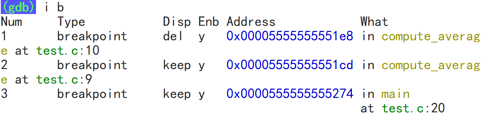

# 编译工具链

## 生成可执行程序的过程

按照细致的小过程来说，这个过程包含：预处理、编译、汇编、链接四个小过程。


## 预处理过程指令

```shell
gcc -E hello.c -o hello.i           # -E选项，表示激活预处理过程，生成预处理后的文件
# -E preprocess
# -o output
```

## 编译过程指令

```shell
gcc -S hello.i -o hello.s           # —S选项，表示激活预处理和编译两个过程，会生成汇编代码文件
# -S assembly
```

## 汇编过程指令

```shell
gcc -c hello.s -o hello.o           # -c选项，激活预处理、编译和汇编三个过程，生成目标文件 (广义上的编译)
#-c compile
```

## 链接过程指令

```shell
gcc hello.c                                 # 生成可执行程序，未指定可执行程序的名称，默认生成a.out
gcc hello.c -o hello                        # 生成可执行程序hello
gcc hello.o main.o -o main                  # 将两个目标文件链接组合生成一个可执行程序
```

不加任何选项，直接使用`gcc`指令，该指令可能激活预处理、编译、汇编和链接四个步骤。**大多数情况下，都会选择使用该指令，一步到位。**

## gcc指令其它常用选项

**-Wall添加警告信息：**

```shell
gcc hello.c -o hello -Wall
#-Wall warning all
```

**-O0,-O1,-O2,-O3编译器优化级别：**

==O --Optimization==

编译器的4个优化级别，-O0表示不优化，-O1为默认值，开发时常选择，-O2为生产环境下常用的优化级别，-O3的优化级别最高。

-O3的优化手段比较激进，生产环境一般不会选择。

**-g添加调试信息：**

```shell
gcc hello.c -o hello -g
```

==g --generate debugging information==

**-I选项**

```shell
gcc hello.c -o hello -I../header
```

==I -Include==

`-I`选项的作用实际上是：

改变头文件包含语法的搜索目录优先级，总是优先去搜索该选项指定的目录，搜索不到时，才按照既定的搜索的路径搜索。比如：

1. `<>`方式：**表示搜索头文件时，总是先去"../header"下搜索，搜索不到时，再去操作系统头文件目录中寻找。**
2. `""`方式：**表示搜索头文件时，总是先去"../header"下搜索，搜索不到再去当前目录"."中寻找头文件，如果还找不到再去操作系统头文件目录中寻找。**

# GDB调试程序

## 带调试信息编译代码

编译过程会去掉代码中诸如变量名这样的调试信息，从汇编代码开始这些调试信息就被替换成了内存地址。

所以要想使用GDB调试程序。首先第一步就是：**使用带"-g"的指令编译生成可执行程序。**

```shell
gcc hello.c -o hello -g -O0 -Wall       #-g为必加选项
```

## 进入GDB调试界面

```shell
# 第一种方式直接将可执行程序文件名作为参数
gdb 可执行程序名字
# 第二种需要先进入gdb控制台
gdb 
file 可执行程序名字        # 进入gdb控制台后再使用file指令
```

## 查看源代码

```shell
list/l  [文件名:][行号|函数名]
```

```shell
(gdb) l                             # 下翻源代码
(gdb) l -                           # 上翻源代码
(gdb) l 20                          # 查看启动程序20行附近的源代码
(gdb) l main                        # 查看启动程序main函数附近的源代码
(gdb) l main.c:20                   # main.c文件第20行附近的源代码
(gdb) l main.c:main                 # main.c文件main函数附近的源代码
```

```shell
run/r       #相当于在VS中点击以Debug模式启动的按钮，一般用于结束一次调试后重启调试或者中断并重启调试
kill/k      #停止当前正常调试的程序，但不会退出GDB 
quit/q      #直接退出GDB，当然调试也会立刻结束
```

## 打断点

```shell
break/b   [文件名:][行号|函数名]            #在某个位置设置一个普通的、持续生效的断点
tbreak/tb [文件名:][行号|函数名]            #在某个位置设置一个只生效一次的一次性断点
```

```shell
(gdb) b 20                          # 在第20行设置断点
(gdb) b main                        # 在main函数的开头设置断点
(gdb) b main.c:20                   # main.c文件的第20行设置断点
(gdb) b main.c:main                 # 在main.c文件的main函数开头设置断点
```

```shell
info break/i b                      #可以省略到只剩下i b，但空格不能省略，不能使用ib
```



这段信息从左往右内容是：

1. Num：断点的唯一性标识编号，一次Debug过程断点编号会从1开始，且不会重置一直累加。
2. Type：断点的类型，这里显示"breakpoint"，表示断点都只是普通断点。
3. Disp(Disposition，性格)：它表示断点触发后，是否会继续触发。
   1. keep就表示它是一个持久的断点，只要不删除就一直存在，每次启动都会触发。
   2. 这个值如果是**del**就表示，该断点是一个一次性断点。
4. Enb(enable)：指示断点是否生效，可以通过`dis`指令设置该属性。
5. What：指示断点在源代码的哪个位置

```shell
delete/d [n]            #如果不加断点编号就是删除所有断点，若加上编号则表示删除n号断点
```

```shell
(gdb) d 2               # 删除2号断点
(gdb) d                 # 如果不加断点编号，则表示删除所有断点
```

```shell
disable/dis [n]         #使所有断点失效/单独使n号断点失效
enable/en [n]           #使所有断点生效/单独使n号断点生效
```

## GDB常用调试指令

**逐语句/单步调试**

```shell
(gdb) step/s
```

**跳出并执行完函数**

```shell
(gdb) finish/fin
```

**逐过程**

```shell
(gdb) next/n
```

**监视窗口/查看变量取值**

```shell
print/p express             #后面直接跟一个表达式即可，完全把这个功能当成Linux的计算器来使用
```

```shell
(gdb) p arr[0]          #输出查看当前a变量的值
(gdb) p 3.14*2*2        #作为计算器使用
```

```shell
print/p express=val
```

```shell
(gdb) p arr[0]=10
```

**如果想要持续的，展示某个表达式的值，使用格式如下：**

```shell
display/disp express                    # 每调试一步输出一次express的值
undisplay/undisp [n]                    # 删除所有或[n]号自动展示的表达式
info display/i disp                     # 显示所有自动展示的表达式信息
```

**如果需要查看所有局部变量的值，局部变量窗口，使用格式如下：**

```shell
(gdb) info/i args                   # 查看函数的参数
(gdb) info/i locals                 # 查看函数所有局部变量的值
```

**继续，跳过一次断点：**

```shell
(gdb) c                             #conntinue 相当于VS当中的继续功能按钮
```

**忽略断点n次**

```shell
ignore N COUNT
(gdb) ignore 1 10           # 忽略1号断点10次
```

**查看堆栈信息**

```shell
bt/backtrace                #查看当前调用堆栈的信息，会一直追溯到程序启动
```

**查看内存，内存窗口**

```shell
x/(内存单元的个数)(内存数据的输出格式)(一个内存单元的大小) 数组名/指针/地址值...
```

==x --examine==

内存数据的输出格式有：

1. o(octal)，八进制整数
2. x(hex)，十六进制整数
3. d(decimal)，十进制整数
4. u(unsigned decimal)，无符号整数
5. t(binary)，二进制整数
6. f(float)，浮点数
7. c(char)，字符
8. a(address)，地址值
9. c(character)：字符
10. s(string)，字符串

一个内存单元的大小的表示，有以下格式：

1. b(byte)，一个字节
2. h(halfword,  2 bytes)，二个字节
3. w(word, 4 bytes)，四个字节
4. g(giant, 8 bytes)，八个字节

```shell
# 自数组nums基地址起，每4个字节为一个内存单元，连续查看4个内存单元，以十进制整数的方式展示内存数据
(gdb) x/4dw nums
# 可能的输出结果如下所示：
# 0x7fffffffe1f0:   10  20  30  40
# 也就是说此int类型的nums数组，元素取值分别是10、20、30、40

# 自指针数组strs的基地址开始，每8个字节为一个内存单元，连续查看5个内存单元，以十六进制整数的方式展示内存数据
# 由于使用64位系统生成64位程序，8个字节即为指针的大小，所以这里实际上是查看指针数组的每一个元素地址值，即每一个字符串元素的指针
(gdb) x/5xg strs
# 可能的输出结果如下所示：
    # 0x7fffffffe210:   0x0000555555556004  0x0000555555556008
    # 0x7fffffffe220:   0x000055555555600c  0x0000555555556012
    # 0x7fffffffe230:   0x0000555555556016
# 冒号左边都是内存地址值，右边表示此内存地址上存储的地址（指针），指向一个字符串

# 可以继续查看这些指针元素，指向的字符串内容
(gdb) x/s 0x0000555555556004
(gdb) x/s 0x0000555555556008
# 可能的输出结果如下所示：
# 0x555555556004:   "abc"
# 0x555555556008:   "123"

# 对于字符串数组这样，需要解引用两次才能看到元素的，也可以使用下列方式来查看元素：
(gdb) x/s *strs             # 查看第一个元素字符串
(gdb) x/s strs[1]           # 查看第二个元素字符串
(gdb) x/s *(strs + 1)       # 查看第二个元素字符串
```

**输入命令行参数**

当main函数的形参列表是`int argc, char *argv[]`时，允许可执行程序传参命令行参数。如果想要使用GDB调试带命令行参数的可执行程序，有以下两种方式可以选择：

1. 在启动GDB时，使用指令`gdb --args ./a.out arg1 arg2 arg3...`即可表示传递命令行参数，其中`a.out`表示可执行程序的名字。
2. 如果已经启动了GDB，可以使用以下两种方式都可以传递命令行参数：
   1. 使用指令`set args arg1 arg2....`，其中指令部分是`set args`，后面的部分则是参数。
   2. 使用指令`run/r arg1 arg2`启动，也表示传递命令行参数。

**利用display，持续显示数组特定范围的取值：**

```shell
display/disp arr[0]@len         # 持续显示数组arr从索引0开始的len个元素。
```

**观察断点：**

```shell
watch/wa expression         # 设置一个断点，当expression的取值发生变化时，程序自动停止
```

## 调试Coredump文件

`Coredump` 文件常用于辅助分析和 Debug，下面简单介绍一下这种调试手段。

```shell
ulimit -a       #查看当前 shell 进程的各种资源限制，比如core文件最大大小、最大打开文件数、最大用户进程数等等。
```

==ulimit --user limit==

默认情况下，该指令输出的第一行就是：

> core file size          (blocks, -c) 0

表示此时系统允许生成的core文件最大是0个字节，即不允许生成。

所以我们需要用下列指令将core文件的大小设置为不受限制：

```shell
ulimit -c unlimited         # 将core文件的大小临时设置为不受限制 
```

默认情况下，上述操作后可能还是无法生成Core文件，可以**切换到root用户或者使用sudo权限**，然后补充一下core文件的配置信息到目标文件里。

具体的操作如下，先打开配置文件：

```shell
sudo vim /etc/sysctl.conf                   # 打开配置文件，将下列信息补进去
```

将下列信息补充到配置文件末尾**（注意前面不要加#号）**：

```shell
kernel.core_pattern = ./core_%e_%t          # %e:崩溃程序的名称, %t:崩溃时的时间戳
```

紧跟着还需要执行以下指令让配置信息生效：

```shell
sudo sysctl -p                              # 让配置文件生效，但每次重启会话连接可能都需要再执行一次
```

这段配置信息的目的是给core文件设定一个固定的格式，这样设置后，再次执行报错可执行程序就会生成core文件了。

但是要注意：一般只有段错误才会生成对应core文件，像上面数组越界引发未定义行为是没有段错误的，也就不会生成core文件。

然后就可以用指令：

```shell
gdb hello core_hello_1679196427     # gdb + 可执行文件的名字 + core文件名
```

查看报错的一些信息，此时再利用`bt`等指令就可以进行正常的程序调试了。

