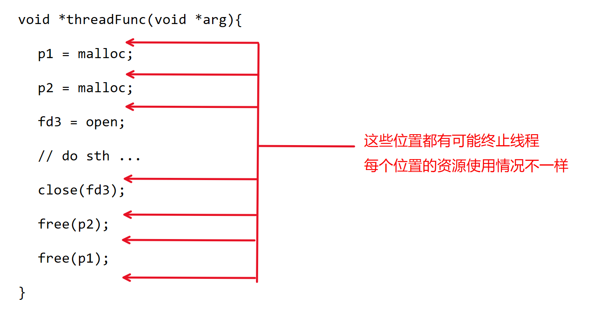
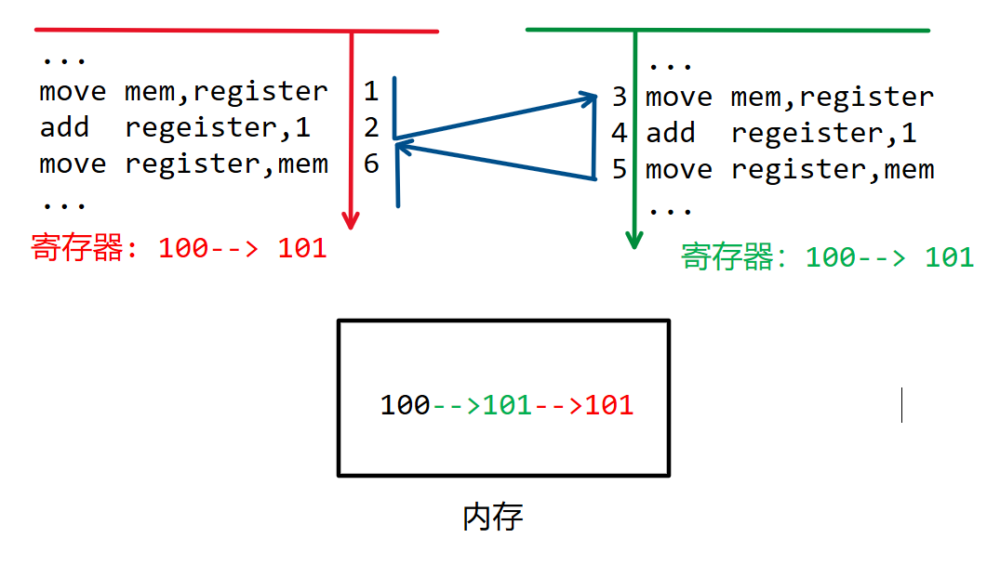
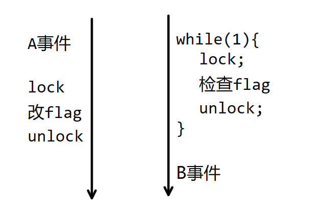

# 线程

## 线程的创建和终止

| 线程函数       | 功能                       | 类似的进程函数 |
| -------------- | -------------------------- | -------------- |
| pthread_create | 创建一个线程               | fork           |
| pthread_exit   | 线程退出                   | exit           |
| pthread_join   | 等待线程结束并回收内核资源 | wait           |
| pthread_self   | 获取线程id                 | getpid         |

### 错误处理

```c
char *strerror(int errnum);
#define THREAD_ERROR_CHECK(ret,msg) {if(ret!=0){\
fprintf(stderr,"%s:%s\n",msg,strerror(ret));}}
```

> [!note]
>
> 新版的`errno`不是全局变量
>
> 为了支持多线程，POSIX标准要求`errno`必须是线程安全的。这意味着每个线程需要有自己独立的`errno`实例，避免不同线程之间的干扰。因此，实现上`errno`可能不再是一个简单的全局变量，而是通过`线程局部存储（Thread-Local Storage, TLS）`来实现，每个线程拥有自己的`errno`副本。
>
> 尽管如此，返回值表示错误原因的设计已经固定下来了，考虑到兼容性，也不会做修改了。

### 线程的创建

```c
#include <pthread.h>
int pthread_create(pthread_t *thread, const pthread_attr_t *attr, void *(*start_routine)(void *), void *arg);
```

```c
// 获取本线程的tid
int main() {
    printf("pid = %d,tid = %lu\n", getpid(), pthread_self());
    return 0;
}
```

```c
// 下面是一个不传递参数的版本
void *threadFunc(void *arg) {
    printf("I am child thread, tid = %lu\n",pthread_self());
    return NULL;
}
int main() {
    pthread_t tid;
    int ret = pthread_create(&tid, NULL, threadFunc, NULL);
    THREAD_ERROR_CHECK(ret, "pthread_create");
    printf("I am main thread, tid = %lu\n", pthread_self());
    sleep(1);
    // usleep(20);
    return 0;
}
```


### 线程主动退出

```c
void pthread_exit(void *retval);
```

```c
void *threadFunc(void *arg) {
    printf("I am child thread, tid = %lu\n",pthread_self());
    // pthread_exit(NULL);和在线程入口函数return(NULL)等价
    printf("Can you see me?\n");
}
int main() {
    pthread_t tid;
    int ret = pthread_create(&tid, NULL, threadFunc, NULL);
    THREAD_ERROR_CHECK(ret, "pthread_create");
    printf("I am main thread, tid = %lu\n", pthread_self());
    sleep(1);
    return 0;
}
```

### 获取线程退出状态

```c
int pthread_join(pthread_t thread, void **retval);
```

```c
void *threadFunc(void *arg) {
    printf("I am child thread, tid = %lu\n", pthread_self());
    // pthread_exit(NULL);//相当于返回成一个8字节的0
    // pthread_exit((void *)1);
    char *tret = (char *)malloc(20);
    strcpy(tret, "hello");
    return (void *)tret;
}
int main() {
    pthread_t tid;
    int ret = pthread_create(&tid, NULL, threadFunc, NULL);
    THREAD_ERROR_CHECK(ret, "pthread_create");
    printf("I am main thread, tid = %lu\n", pthread_self());
    void *tret;                     // 在调用函数中申请void*变量
    ret = pthread_join(tid, &tret); // 传入void*变量的地址
    THREAD_ERROR_CHECK(ret, "pthread_join");
    // printf("tret = %ld\n", (long) tret);
    printf("tret = %s\n", (char *)tret);
    return 0;
}
```

## 线程的取消和资源清理

### 线程的取消

```c
int pthread_cancel(pthread_t thread);
```

```shell
$man 7 pthreads
部分取消点：
accept()
close()
connect()
open()
pthread_cond_timedwait()
pthread_cond_wait()
pthread_join()
pthread_testcancel()
read()
```

```c
void *threadFunc(void *arg) {
    printf("I am child thread, tid = %lu\n", pthread_self());
    return (void *)0;
}
int main() {
    pthread_t tid;
    int ret = pthread_create(&tid, NULL, threadFunc, NULL);
    THREAD_ERROR_CHECK(ret, "pthread_create");
    printf("I am main thread, tid = %lu\n", pthread_self());
    void *pret;
    ret = pthread_cancel(tid);
    THREAD_ERROR_CHECK(ret, "pthread_cancel");
    ret = pthread_join(tid, &pret);
    THREAD_ERROR_CHECK(ret, "pthread_join");
    printf("thread return = %ld\n", (long)pret);
    return 0;
}
// 可以发现pthread_cancel执行成功，因为获取的返回值是-1而不是正常退出的0
```

```c
void pthread_testcancel(void);
```

```c
void *threadFunc(void *arg) {
    while (1) {
        pthread_testcancel();
    }
}
int main() {
    pthread_t tid;
    pthread_create(&tid, NULL, threadFunc, NULL);
    sleep(1);
    printf("sleep over!\n");
    pthread_cancel(tid);
    void *ret;
    pthread_join(tid, &ret);
    printf("You die, ret = %ld\n", (long)ret);
    return 0;
}
```

### 线程资源清理



为了让线程无论在什么位置终止，都能够根据实际持有的资源情况来执行资源释放操作。`pthread`库引入了资源清理机制：

- `pthread`库为每一个线程设计了一个**资源清理函数栈**
- 栈当中的每一个元素是一个函数指针和一个参数（这个函数可以用来释放占用的资源，称为**清理函数**）
- 用户每次申请资源之后，需要立刻执行压栈操作
- 用户的资源释放行为会被替换成弹栈

`pthread_cleanup_push`和`pthread_cleanup_pop`函数可以用来管理资源清理函数栈。

```c
void pthread_cleanup_push(void (*routine)(void *), void *arg);
void pthread_cleanup_pop(int execute);
```

`pthread_cleanup_push`负责将清理函数压栈，这个栈会在下列情况下弹出：

- 线程因为取消而终止时，所有清理函数按照后进先出的顺序从栈中弹出并执行。
- 线程调用`pthread_exit`而主动终止时，所有清理函数按照后进先出的顺序从栈中弹出并执行。
- 线程调用`pthread_clean_pop`并且`execute`参数非0时，弹出栈顶的清理函数并执行。
- 线程调用`pthread_clean_pop`并且`execute`参数为0时，弹出栈顶的清理函数不执行。

值得特别注意的是：**当线程在`start_routine`中执行return语句而终止的时候，清理函数不会弹栈！**

```c
void freep1(void *arg) {
    void *p1 = arg;
    printf("free p1!\n");
    free(p1);
}
void freep2(void *arg) {
    void *p2 = arg;
    printf("free p2!\n");
    free(p2);
}
void closefd3(void *arg) { // 包装函数，其参数和返回值固定
    int *pfd3 = (int *)arg;
    printf("close fd3!\n");
    close(*pfd3); // 调用真正的清理行为
}
void *threadFunc(void *arg) {
    void *p1 = malloc(4);
    pthread_cleanup_push(freep1, p1); // pthread_cleanup_push不是取消点！
    void *p2 = malloc(4);
    pthread_cleanup_push(freep2, p2);
    int fd3 = open("file1", O_RDWR | O_CREAT, 0666);
    pthread_cleanup_push(closefd3, &fd3);
    printf("------------------------do something!\n");
    pthread_cleanup_pop(1);
    pthread_cleanup_pop(1);
    printf("------------------------\n");
    pthread_exit(NULL); // 无论在什么位置终止，线程都能根据实际持有的资源来执行释放行为。
    pthread_cleanup_pop(1);
}
int main(int argc, char *argv[]) {
    pthread_t tid;
    pthread_create(&tid, NULL, threadFunc, NULL);
    pthread_join(tid, NULL);
    return 0;
}
```

POSIX要求`pthread_cleanup_push`和`pthread_cleanup_pop`必须成对出现在同一个作用域当中，主要是为了约束程序员在清理函数当中的行为。下面是在`/urs/include/pthread.h`文件当中，线程清理函数的定义：

```c
#define pthread_cleanup_push(routine, arg) \
    do {                                   \
    __pthread_cleanup_class __clframe(routine, arg)

/* Remove a cleanup handler installed by the matching pthread_cleanup_push.
   If EXECUTE is non-zero, the handler function is called. */
#define pthread_cleanup_pop(execute) \
    __clframe.__setdoit(execute);    \
    }                                \
    while (0)
```

# 互斥锁

## 竞态条件



我们来看一下上图的执行过程：

1. 现在有两个线程在并发执行，左边的线程先将内存当中100拷贝到本线程的寄存器当中
2. 左边线程在对寄存器的数据做完增加操作的到数据101以后，触发了线程切换
3. 右边线程也是先将内存的数据100拷贝到本线程的寄存器当中（由于左边线程没有写回内存，所以内存的数据还是100）
4. 右边线程增加数据再将数据101写回内存
5. 触发切换，左边线程继续将寄存器的数据101写回内存

上图最后的结果就是，两个线程各自做了一次加1，但是最终的结果当中却没有加2。那么，竞争条件产生的直接原因也就很明显了：当内存设备的数据和寄存器的数据不一致的时候，发生了线程切换。假如我们想要解决竞争条件问题，最直接的解决方案就是控制线程切换的位置，只有在内存和寄存器数据一致的时候才允许发生切换，也就是说我们希望`读取-修改-写回`这个过程是**原子**的。

如何才能实现原子性呢？这里有很多种不同层次的解决方案：

- 硬件层面上的关中断、原子操作、内存屏障、缓存一致性协议等等；
- 操作系统层面上的信号量、锁等等；
- 软件层面的互斥算法，比如`Dekker`算法、`Peterson`算法等等。

目前来说，解决竞争条件问题比较常见且实用的机制就是互斥锁。

## 互斥锁的基本使用

在多线程编程中，用来控制共享资源的最简单有效也是最广泛使用的机制就是`mutex(MUTual EXclusion)`，即**互斥锁**。

互斥锁的数据类型是`pthread_mutex_t`，其本质是一个共享的标志位，它存在两种状态：未锁和已锁。在此基础上，互斥锁支持两个原语（原语是不可分割的操作的意思）：

1. 原子地测试并改为已锁状态，即所谓的**加锁**。当一个线程持有锁的时候，其余线程再尝试加锁时（包括自己再次加锁），会使自己陷入阻塞状态，直到锁被持有线程解锁才能恢复运行。所以锁在某个时刻永远不能被两个线程同时持有。
2. **解锁**，将锁的状态从已锁改成未锁。

创建锁并且让其处于未锁状态的方法有两种：

- 直接用`PHTREAD_MUTEX_INITIALIZER`初始化一个`pthread_mutex_t`类型的变量，即静态初始化锁；
- 而使用`pthread_mutex_init`函数可以动态创建一个锁。动态创建锁的方式更加常见。

使用`pthread_mutex_lock`可以加锁，使用`pthread_mutex_unlock`可以解锁。使用`pthread_mutex_destory`可以销毁一个锁。

```c
pthread_mutex_t fastmutex = PTHREAD_MUTEX_INITIALIZER;
int pthread_mutex_init(pthread_mutex_t *mutex, const pthread_mutexattr_t *mutexattr);
int pthread_mutex_destroy(pthread_mutex_t *mutex);
int pthread_mutex_lock(pthread_mutex_t *mutex);
int pthread_mutex_unlock(pthread_mutex_t *mutex);
int pthread_mutex_trylock(pthread_mutex_t *mutex);
```

下面是一个使用锁来保护共享资源的例子。使用锁的原则有这样几个：

- 在访问共享资源之前，无论是读取还是写入共享资源，都要先加锁；
- 在访问共享资源之后，需要立即解锁；
- 从加锁到解锁之间的代码段称为**临界区**，在保证正确性的情况下，临界区越短越好。
- 此外，还有一个重要的编程规范：**谁加锁，谁解锁。**

```c
#define NUM 10000000
typedef struct shareRes_s {
    int num;
    pthread_mutex_t mutex;
} shareRes_t; // share resource
void *threadFunc(void *arg) {
    shareRes_t *pshareRes = (shareRes_t *)arg;
    for (int i = 0; i < NUM; ++i) {
        pthread_mutex_lock(&pshareRes->mutex);
        ++pshareRes->num;
        pthread_mutex_unlock(&pshareRes->mutex);
    }
    pthread_exit(NULL);
}
int main(int argc, char *argv[]) {
    shareRes_t shareRes;                       // 在栈上申请一片内存
    shareRes.num = 0;                          // 初始化
    pthread_mutex_init(&shareRes.mutex, NULL); // 给锁做动态初始化
    pthread_t tid;
    pthread_create(&tid, NULL, threadFunc, &shareRes); // shareRes_t * --> void *
    for (int i = 0; i < NUM; ++i) {
        pthread_mutex_lock(&shareRes.mutex);
        ++shareRes.num;
        pthread_mutex_unlock(&shareRes.mutex);
    }
    pthread_join(tid, NULL);
    printf("num = %d\n", shareRes.num);
    return 0;
}

```

## 加锁和解锁的性能消耗


根据上图可以得出结论：加锁/解锁的时间开销只比访问寄存器和L1缓存大，比访问内存、磁盘和网络都要小，因此在绝大多数应用程序当中，加锁解锁的次数对于程序性能没有影响。相反地，使用互斥锁的性能风险，一般来源于临界区的长度——当某个线程的临界区太长的时候，该线程会一直持有锁，导致其他需要使用共享资源的线程均阻塞，影响了整个应用程序的性能。

## 非阻塞加锁

`pthread_mutex_trylock`函数可以用来非阻塞地加锁——假如互斥锁处于未锁状态，则加锁成功；假如互斥锁处于已锁状态，函数会直接报错并返回。

```c
typedef struct shareRes_s {
    pthread_mutex_t mutex;
} shareRes_t, *pShareRes_t;
void *threadFunc(void *arg) {
    // pthread_mutex_lock(&((pShareRes_t)arg)->mutex); //这句指令是否注释会影响trylock的返回值
    puts("I am child thread");
}
int main() {
    shareRes_t shared;
    pthread_t tid;
    pthread_mutex_init(&shared.mutex, NULL);
    pthread_create(&tid, NULL, threadFunc, &shared);
    sleep(1);
    int ret = pthread_mutex_trylock(&shared.mutex);
    printf("I am main thread, ret = %d\n", ret);
    pthread_mutex_unlock(&shared.mutex);
    pthread_join(tid, NULL);
    return 0;
}
```

## 死锁

使用互斥锁的时候必须小心谨慎，尽量按照一定的规范使用。如果使用不当的话，很有可能会出现死锁问题。**死锁**是指一个或多个线程因争夺资源陷入无限等待的状态。例如，线程A持有锁L1并请求锁L2，而线程B持有锁L2并请求锁L1，双方都无法释放已持有的锁，导致程序停滞。

**死锁的四个必要条件**

- 互斥条件（Mutual Exclusion）：资源每次只能被一个线程占用。 

- 持有并等待（Hold and Wait）：线程持有至少一个资源，同时等待其他资源。 

- 不可剥夺（No Preemption）：资源只能由持有者主动释放，不可强行剥夺。 

- 循环等待（Circular Wait）：存在线程-资源的环形等待链（如T1等待T2占用的资源，T2等待T1占用的资源）。

常见的死锁场景有这样几种：

1. 双锁交叉请求：线程t1先加锁M1，再加锁M2；线程t2先加锁M2，再加锁M1；如果加锁时机不对，t1锁上M1之后t2也锁上了M2，此时会触发永久等待；
2. 持有锁的线程终止：线程t1先加锁M，然后终止，线程t2随后加锁M，将会陷入永久等待；
3. 持有锁的线程重复加锁：线程t1先加锁M，然后t1再加锁M，此时会永久等待。

为了一定程度上避免第三种死锁场景，可以使用`pthread_mutexattr_settype`函数修改锁属性：

- **检错锁**在重复加锁时会触发报错。
- **可重入锁**在重复加锁时不会死锁，只是会增加锁的引用计数，解锁时也只是减少锁的引用计数。

```c
typedef struct shareRes_s {
    pthread_mutex_t mutex;
} shareRes_t, *pShareRes_t;
void *threadFunc(void *arg) {
    pShareRes_t p = (pShareRes_t)arg;
    pthread_mutex_lock(&p->mutex);
    puts("fifth");
    pthread_mutex_unlock(&p->mutex);
}
int main() {
    shareRes_t shared;
    int ret;
    pthread_mutexattr_t mutexattr;
    pthread_mutexattr_init(&mutexattr);
    // ret = pthread_mutexattr_settype(&mutexattr,PTHREAD_MUTEX_ERRORCHECK); //检错锁
    ret = pthread_mutexattr_settype(&mutexattr, PTHREAD_MUTEX_RECURSIVE); // 可重入锁
    THREAD_ERROR_CHECK(ret, "pthread_mutexattr_settype");
    pthread_t tid;
    pthread_create(&tid, NULL, threadFunc, (void *)&shared);
    pthread_mutex_init(&shared.mutex, &mutexattr);
    ret = pthread_mutex_lock(&shared.mutex);
    THREAD_ERROR_CHECK(ret, "pthread_mute_lock 1");
    puts("first");
    ret = pthread_mutex_lock(&shared.mutex);
    THREAD_ERROR_CHECK(ret, "pthread_mute_lock 2");
    puts("second");
    pthread_mutex_unlock(&shared.mutex);
    puts("third");
    pthread_mutex_unlock(&shared.mutex); // 两次加锁，要有两次解锁
    puts("forth");
    pthread_join(tid, NULL);
    return 0;
}
```

互斥锁应该是最常见的线程同步工具，它的作用是保护共享资源，确保同一时间只有一个线程可以访问该资源。当一个线程获得了互斥锁之后，其他试图获取该锁的线程会被阻塞，直到锁被释放。互斥锁适用于那些需要独占访问资源的场景，比如修改全局变量或者操作数据结构的时候。

读写锁应该允许多个线程同时读取某个资源，但在写入时需要独占访问。也就是说，当没有写线程时，多个读线程可以同时获取锁；但一旦有写线程请求锁，后续的读线程会被阻塞，直到写线程完成操作。读写锁适用于读操作频繁而写操作较少的场景，这样可以提高并发性能。

自旋锁和互斥锁类似，都是用于保护临界区，但自旋锁在获取锁失败时不会让线程进入睡眠状态，而是会一直循环（自旋）检查锁是否被释放。这在多核系统中可能更高效，因为避免了线程切换的开销，但如果锁被长时间持有，会导致CPU资源的浪费。自旋锁适用于临界区很小且持有时间很短的场景，比如内核中的某些操作。

# 同步和条件变量

## 利用互斥锁实现同步

**同步**是指通过协调多个执行单元的行为，确保它们按照预期的逻辑顺序执行。理论上来说，利用互斥锁可以解决同步问题的：

- 假设我们的目标是无论按照什么样的顺序分配CPU，总能够让t1线程的A事件先执行而t2线程的B事件后执行；
- 我们先设置一个共享状态flag，用来记录A事件是否完成了。
- t1线程的代码：执行A事件-->加锁-->修改状态flag-->解锁
- t2线程的代码：先用死循环加锁flag，每次检查前后需要加锁解锁-->一旦flag有变，则离开死循环-->执行B事件。



根据上图可知，无论t1线程和t2线程按照什么样的顺序交织执行，总是能够满足A先B后的要求。这样，就利用了互斥锁来实现了同步机制。但是这种只依赖于互斥锁的方案也会存在问题，当t2线程占用CPU但是A事件并没有完成的情况下，t2会执行大量的重复的“加锁-检查条件不满足-解锁”的操作，也就是说不满足条件的线程会一致占用CPU，非常浪费资源。这种CPU资源的浪费的根本原因是**竞争**——即使本线程不具备继续运行的条件，也要时刻处于就绪状态抢占CPU。

## 条件变量

对于依赖于共享资源这种条件来控制线程之间的同步的问题，我们希望采用一种**无竞争**的方式让多个线程在共享资源处汇合——这就是**条件变量**要完成的目标。

条件变量提供了两个基本的原语：**等待**和**唤醒**。执行后事件的线程运行时可以等待，执行先事件的线程在做完事件之后可以唤醒其他线程。条件变量的使用是有一定的规范的：在使用条件变量的时候，由于CPU的分配顺序是随机的，所以可能会出现这样的情况——一个线程唤醒时另一个线程还没有进入等待，为了规避无限等待的场景，用户需要根据业务需求去设计一个**状态/条件**（一般是一个标志位）来表示事件是否已经完成的，这个状态是多线程共享的，故修改的时候必须加锁访问，这就意味着**条件变量一定要配合锁来使用**。

接下来来举一个条件变量的例子:

业务场景：假设有两个线程t1和t2并发运行，t1会执行A事件，t2会执行B事件，现在业务要求，无论t1或t2哪个线程先占用CPU，总是需要满足A先B后的同步顺序。

解决方案：

- 在t1和t2线程执行之前，先将**状态初始化为A未执行**。
- t1线程执行A事件，执行完成以后先加锁，**修改状态为B可执行**，并唤醒条件变量，然后解锁（解锁和唤醒这两个操作可以交换顺序）；
- t2线程先加锁，然后检查状态：假如B不可执行，则B阻塞在条件变量上，当t2阻塞在条件变量以后，t2线程会解锁并陷入阻塞状态直到t1线程唤醒为止，t2被唤醒以后，会先加锁。接下来t2线程处于加锁状态，可以在解锁之后，再来执行B事件；而假如状态为B可执行，则t2线程处于加锁状态继续执行后续代码，也可以在解锁之后，再来执行B事件。


上面的设计可以保证：无论t1和t2按照什么样的顺序交织执行，A事件总是先完成，B事件总是后完成——即使是比较极端的情况也是如此：比如t1一直占用CPU直到结束，那么t2占用CPU时，状态一定是B可执行，则不会陷入等待；又比如t2先一直占用CPU，t2检查状态时会发现状态为B不可执行，就会阻塞在条件变量之上，这样就要等到A执行完成以后，才能醒来继续运行。

## 条件变量相关的库函数

```c
pthread_cond_t cond = PTHREAD_COND_INITIALIZER;                                                           // 静态初始化
int pthread_cond_init(pthread_cond_t *cond, pthread_condattr_t *cond_attr);                               // 动态初始化
int pthread_cond_signal(pthread_cond_t *cond);                                                            // 唤醒至少一个线程
int pthread_cond_broadcast(pthread_cond_t *cond);                                                         // 唤醒所有线程
int pthread_cond_wait(pthread_cond_t *cond, pthread_mutex_t *mutex);                                      // 等待
int pthread_cond_timedwait(pthread_cond_t *cond, pthread_mutex_t *mutex, const struct timespec *abstime); // 具有超时时限的等待
int pthread_cond_destroy(pthread_cond_t *cond);                                                           // 条件变量销毁
```

`pthread_cond_wait`的执行流程如下：

进入阻塞之前：

1. 检查互斥锁是否存在且处于已锁状态；
2. 将本线程加入到唤醒队列当中；
3. 解锁并将本线程陷入阻塞态；

在醒来之后（比如被`pthread_cond_signal`了）

- 将互斥锁加锁（可能会再次陷入等待）；
- 函数返回

`pthread_cond_wait`在调用之前是已锁的，返回之后也是已锁的，在等待期间是未锁的。这样设计的原因如下：

1. `pthread_cond_wait`一般会配合状态使用，并且需要在if条件下执行，所以需要保证无论是否调用`pthread_cond_wait`，离开if结构之后都是已锁状态；
2. `pthread_cond_wait`等待期间其他线程应该有能力修改状态，所以将锁解开。

```c
typedef struct shareRes_s {
    int flag; // flag 0 A可以执行 1 B可以执行
    pthread_mutex_t mutex;
    pthread_cond_t cond;
} shareRes_t;
void A() {
    printf("Before A\n");
    sleep(3);
    printf("After A\n");
}
void B() {
    printf("Before B\n");
    sleep(3);
    printf("After B\n");
}
void *threadFunc(void *arg) {
    sleep(5);
    shareRes_t *pshareRes = (shareRes_t *)arg;
    pthread_mutex_lock(&pshareRes->mutex);
    if (pshareRes->flag != 1) {
        pthread_cond_wait(&pshareRes->cond, &pshareRes->mutex);
    }
    pthread_mutex_unlock(&pshareRes->mutex);
    B();
    pthread_exit(NULL);
}
int main(int argc, char *argv[]) {
    shareRes_t shareRes;
    shareRes.flag = 0;
    pthread_mutex_init(&shareRes.mutex, NULL);
    pthread_cond_init(&shareRes.cond, NULL);

    pthread_t tid;
    pthread_create(&tid, NULL, threadFunc, &shareRes);

    A();
    pthread_mutex_lock(&shareRes.mutex);
    shareRes.flag = 1;
    pthread_cond_signal(&shareRes.cond);
    pthread_mutex_unlock(&shareRes.mutex);

    pthread_join(tid, NULL);
    return 0;
}
```

下面是更加复杂的卖火车票的例子，除了拥有两个卖票窗口之外，还会有一个放票部门。

```c
typedef struct shareRes_s {
    pthread_mutex_t mutex;
    pthread_cond_t cond;
    int ticketNum;
} shareRes_t, *pshareRes_t;
void *sellTicket1(void *arg) {
    sleep(1); // 让setTicket先抢到锁
    pshareRes_t pshared = (pshareRes_t)arg;
    while (1) {
        pthread_mutex_lock(&pshared->mutex);
        if (pshared->ticketNum > 0) {
            printf("Before 1 sells tickets, ticketNum = %d\n", pshared->ticketNum);
            --pshared->ticketNum;
            if (pshared->ticketNum == 0) {
                pthread_cond_signal(&pshared->cond);
            }
            usleep(500000);
            printf("After 1 sells tickets, ticketNum = %d\n", pshared->ticketNum);
            pthread_mutex_unlock(&pshared->mutex);
            usleep(200000); // 等待一会，让setTicket抢到锁
        } else {
            pthread_mutex_unlock(&pshared->mutex);
            break;
        }
    }
    pthread_exit(NULL);
}
void *sellTicket2(void *arg) {
    sleep(1);
    pshareRes_t pshared = (pshareRes_t)arg;
    while (1) {
        pthread_mutex_lock(&pshared->mutex);
        if (pshared->ticketNum > 0) {
            printf("Before 2 sells tickets, ticketNum = %d\n", pshared->ticketNum);
            --pshared->ticketNum;
            if (pshared->ticketNum == 0) {
                pthread_cond_signal(&pshared->cond);
            }
            usleep(500000);
            printf("After 2 sells tickets, ticketNum = %d\n", pshared->ticketNum);
            pthread_mutex_unlock(&pshared->mutex);
            usleep(200000);
        } else {
            pthread_mutex_unlock(&pshared->mutex);
            break;
        }
    }
    pthread_exit(NULL);
}
void *setTicket(void *arg) {
    pshareRes_t pshared = (pshareRes_t)arg;
    pthread_mutex_lock(&pshared->mutex);
    if (pshared->ticketNum > 0) {
        printf("Set is waiting\n");
        int ret = pthread_cond_wait(&pshared->cond, &pshared->mutex);
        THREAD_ERROR_CHECK(ret, "pthread_cond_wait");
    }
    printf("add tickets\n");
    pshared->ticketNum = 10;
    pthread_mutex_unlock(&pshared->mutex);
    pthread_exit(NULL);
}
int main() {
    shareRes_t shared;
    shared.ticketNum = 20;
    int ret;
    ret = pthread_mutex_init(&shared.mutex, NULL);
    THREAD_ERROR_CHECK(ret, "pthread_mutex_init");
    ret = pthread_cond_init(&shared.cond, NULL);
    THREAD_ERROR_CHECK(ret, "pthread_cond_init");
    pthread_t tid1, tid2, tid3;
    pthread_create(&tid3, NULL, setTicket, (void *)&shared); // 希望setTicket第一个执行
    pthread_create(&tid1, NULL, sellTicket1, (void *)&shared);
    pthread_create(&tid2, NULL, sellTicket2, (void *)&shared);
    pthread_join(tid1, NULL);
    pthread_join(tid2, NULL);
    pthread_join(tid3, NULL);
    pthread_cond_destroy(&shared.cond);
    pthread_mutex_destroy(&shared.mutex);
    return 0;
}
```

有些情况下，需要让因为不同的原因而陷入等待的线程等待在同一个条件变量下，这样的话，只要任何有意思的事件完成，就可以通过广播的方式来唤醒所有的线程，再让有条件执行的线程继续运行。

下面是这样的例子：在食堂当中存在一个窗口，同时贩卖两种食材黄焖鸡和猪脚饭，所有的学生只能排在一个队列里面。每个学生只能选择一种食物，食堂窗口每一次也只能完成一份食物。需要设计一个合理的流程，来确保每个学生都在自己想要的食物到来以后离开队列。

```c
typedef struct shareRes_s {
    int food; // 0 没有食物 1 黄焖鸡 2 猪脚饭
    pthread_mutex_t mutex;
    pthread_cond_t cond; // 1个条件变量就够用了
} shareRes_t;
void *student1(void *arg) {
    shareRes_t *pshareRes = (shareRes_t *)arg;
    pthread_mutex_lock(&pshareRes->mutex);
    while (pshareRes->food != 1) { // while取代if 是为了兼容虚假唤醒
        printf("没有黄焖鸡， 学生1等待!\n");
        pthread_cond_wait(&pshareRes->cond, &pshareRes->mutex);
        printf("学生1 醒来!\n");
    }
    printf("黄焖鸡真的来了!\n");
    pshareRes->food = 0;
    pthread_mutex_unlock(&pshareRes->mutex);
    pthread_exit(NULL);
}
void *student2(void *arg) {
    shareRes_t *pshareRes = (shareRes_t *)arg;
    pthread_mutex_lock(&pshareRes->mutex);
    while (pshareRes->food != 2) { // while取代if 是为了兼容虚假唤醒
        printf("没有猪脚饭， 学生2等待!\n");
        pthread_cond_wait(&pshareRes->cond, &pshareRes->mutex);
        printf("学生2 醒来!\n");
    }
    printf("猪脚饭真的来了!\n");
    pshareRes->food = 0;
    pthread_mutex_unlock(&pshareRes->mutex);
    pthread_exit(NULL);
}
int main(int argc, char *argv[]) {
    shareRes_t shareRes;
    shareRes.food = 0;
    pthread_mutex_init(&shareRes.mutex, NULL);
    pthread_cond_init(&shareRes.cond, NULL);

    pthread_t tid1, tid2;
    pthread_create(&tid1, NULL, student1, &shareRes);
    pthread_create(&tid2, NULL, student2, &shareRes);

    while (1) {
        int food;
        scanf("%d", &food);

        pthread_mutex_lock(&shareRes.mutex);
        shareRes.food = food;
        if (food == 0) {
            printf("逗你玩!\n");
        } else if (food == 1) {
            printf("来了 黄焖鸡!\n");
        } else if (food == 2) {
            printf("来了 猪脚饭!\n");
        }
        pthread_cond_broadcast(&shareRes.cond);
        pthread_mutex_unlock(&shareRes.mutex);
    }
    pthread_join(tid1, NULL);
    pthread_join(tid2, NULL);
    return 0;
}
```

## 线程的属性

在线程创建的时候，可以给线程指定一些属性，用来控制线程的调度情况、CPU绑定情况、屏障、线程调用栈和线程分离等属性。这些属性可以通过一个`pthread_attr_t`类型的变量来控制，可以使用`pthread_attr_set`系列设置属性，然后可以传入`pthread_create`函数，从控制新建线程的属性。

以`pthread_attr_setdetachstate`为例子演示如何设置线程的属性。

```c
void *threadFunc(void *arg) {
    return NULL;
}
int main() {
    pthread_t tid;
    pthread_attr_t tattr;
    pthread_attr_init(&tattr);
    pthread_attr_setdetachstate(&tattr, PTHREAD_CREATE_DETACHED);
    int ret = pthread_create(&tid, &tattr, threadFunc, NULL);
    THREAD_ERROR_CHECK(ret, "pthread_create");
    ret = pthread_join(tid, NULL);
    THREAD_ERROR_CHECK(ret, "pthread_join");
    pthread_attr_destroy(&tattr);
    return 0;
}
```

分离属性影响一个线程的终止状态是否能被其他线程使用`pthread_join`函数捕获终止状态。如果一个线程设置了分离属性，那么另一个线程使用`pthread_join`时会返回一个报错。

## 线程安全

由于多线程之间是共享同一个进程地址空间，所以多线程在访问共享数据的时候会出现竞争问题，这个问题不只会发生在用户自定义函数中，在一些库函数执行中也可能会出现竞争问题。有些库函数在设计的时候会申请额外的内存，或者会在静态区域分配数据结构——一个典型的库函数就是`ctime`。`ctime`函数会把日历时间字符串存储在静态区域。

```c
void *threadFunc(void *arg) {
    time_t now;
    time(&now);
    char *p = ctime(&now);
    printf("child ptime = %s\n", p);
    sleep(5);
    printf("child ptime = %s\n", p);
    pthread_exit(NULL);
}
int main() {
    pthread_t tid;
    int ret = pthread_create(&tid, NULL, threadFunc, NULL);
    THREAD_ERROR_CHECK(ret, "pthread_create");
    sleep(2);
    time_t mainNow;
    time(&mainNow);
    printf("main time = %s\n", ctime(&mainNow));
    ret = pthread_join(tid, NULL);
    THREAD_ERROR_CHECK(ret, "pthread_join");
    return 0;
}
```

在上述例子中的，`p`指向的区域是静态的，所以即使子线程没有作任何修改，但是因为主线程会调用`ctime`修改静态区域的字符串，子线程两次输出的结构会有不同。使用`ctime_r`可以避免这个问题，`ctime_r`函数会增加一个额外指针参数，这个指针可以指向一个线程私有的数据，比如函数栈帧内，从而避免发生竞争问题。

```c
void *threadFunc(void *arg) {
    time_t now;
    time(&now);
    char buf[256];
    char *p = ctime_r(&now, buf);
    printf("child ptime = %s\n", p);
    sleep(5);
    printf("child ptime = %s\n", p);
    pthread_exit(NULL);
}
int main() {
    pthread_t tid;
    int ret = pthread_create(&tid, NULL, threadFunc, NULL);
    THREAD_ERROR_CHECK(ret, "pthread_create");
    sleep(2);
    char buf[256];
    time_t mainNow;
    time(&mainNow);
    printf("main time = %s\n", ctime_r(&mainNow, buf));
    ret = pthread_join(tid, NULL);
    THREAD_ERROR_CHECK(ret, "pthread_join");
    return 0;
}
```

类似于`ctime_r`这种函数是**线程安全**的，如果额外数据是分配在线程私有区域的情况下，在多线程的情况下并发地使用这些库函数是不会出现并发问题的。在帮助手册中，库函数作者会说明线程的安全属性。

