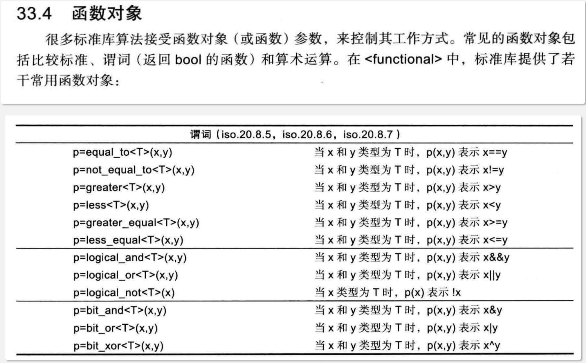

# 基本概念

函数对象（Function Objects），也称为仿函数（Functors），是C++ STL中的重要概念。它们是重载了`operator()`的类或结构体的对象，可以像函数一样被调用，同时具备对象的特性。

还有一个概念,只要可以与小括号进行结合展示出函数含义都可以称为**可调用对象**。

可调用对象包含了：

- 函数对象
- 函数指针
- 函数名
- lambda表达式（可视为一个匿名的函数对象，可以直接在定义后调用，也可以给function函数对象赋值）

很多资料中模糊了函数对象和可调用对象的概念说明。下图出自C++之父的书《C++程序设计语言-第4卷》



还有一个更大范围的概念:**可调用实体**，它在可调用对象的基础上还增加了成员函数、成员函数指针、指向数据成员的指针（这三者的共同特点是也可以调用，但不能仅凭自己完成调用）。

# STL预定义函数对象

## 算术函数对象

```cpp
#include <functional>
#include <iostream>
#include <vector>
#include <algorithm>

int main() {
    std::vector<int> vec1 = {1, 2, 3, 4, 5};
    std::vector<int> vec2 = {10, 20, 30, 40, 50};
    std::vector<int> result(5);
    
    // 使用std::plus进行加法运算
    std::transform(vec1.begin(), vec1.end(), vec2.begin(), 
                   result.begin(), std::plus<int>());
    
    for (int val : result) {
        std::cout << val << " ";  // 输出: 11 22 33 44 55
    }
    std::cout << std::endl;
    
    // 其他算术函数对象
    std::cout << std::minus<int>{}(10, 3) << std::endl;      // 7
    std::cout << std::multiplies<int>{}(4, 5) << std::endl;  // 20
    std::cout << std::divides<int>{}(20, 4) << std::endl;    // 5
    std::cout << std::modulus<int>{}(17, 5) << std::endl;    // 2
    std::cout << std::negate<int>{}(42) << std::endl;        // -42
    
    return 0;
}
```

## 比较函数对象

```cpp
#include <functional>
#include <vector>
#include <algorithm>
#include <iostream>

int main() {
    std::vector<int> numbers = {5, 2, 8, 1, 9, 3};
    
    // 使用std::greater进行降序排序
    std::sort(numbers.begin(), numbers.end(), std::greater<int>());
    
    for (int num : numbers) {
        std::cout << num << " ";  // 输出: 9 8 5 3 2 1
    }
    std::cout << std::endl;
    
    // 其他比较函数对象
    std::cout << std::equal_to<int>{}(5, 5) << std::endl;        // 1 (true)
    std::cout << std::not_equal_to<int>{}(5, 3) << std::endl;    // 1 (true)
    std::cout << std::less<int>{}(3, 5) << std::endl;            // 1 (true)
    std::cout << std::less_equal<int>{}(5, 5) << std::endl;      // 1 (true)
    std::cout << std::greater_equal<int>{}(5, 3) << std::endl;   // 1 (true)
    
    return 0;
}
```

## 逻辑函数对象

```cpp
#include <functional>
#include <vector>
#include <algorithm>
#include <iostream>

int main() {
    std::vector<bool> vec1 = {true, false, true, false};
    std::vector<bool> vec2 = {true, true, false, false};
    std::vector<bool> result(4);
    
    // 逻辑与运算
    std::transform(vec1.begin(), vec1.end(), vec2.begin(),
                   result.begin(), std::logical_and<bool>());
    
    for (bool val : result) {
        std::cout << val << " ";  // 输出: 1 0 0 0
    }
    std::cout << std::endl;
    
    // 逻辑或运算
    std::transform(vec1.begin(), vec1.end(), vec2.begin(),
                   result.begin(), std::logical_or<bool>());
    
    for (bool val : result) {
        std::cout << val << " ";  // 输出: 1 1 1 0
    }
    std::cout << std::endl;
    
    // 逻辑非运算
    std::transform(vec1.begin(), vec1.end(), result.begin(),
                   std::logical_not<bool>());
    
    for (bool val : result) {
        std::cout << val << " ";  // 输出: 0 1 0 1
    }
    std::cout << std::endl;
    
    return 0;
}
```

# 自定义函数对象

## 简单函数对象

```cpp
#include <iostream>
#include <vector>
#include <algorithm>

// 判断是否为偶数
struct IsEven {
    bool operator()(int n) const {
        return n % 2 == 0;
    }
};

// 平方运算
struct Square {
    int operator()(int n) const {
        return n * n;
    }
};

int main() {
    std::vector<int> numbers = {1, 2, 3, 4, 5, 6, 7, 8, 9, 10};
    
    // 计算偶数个数
    int evenCount = std::count_if(numbers.begin(), numbers.end(), IsEven());
    std::cout << "偶数个数: " << evenCount << std::endl;  // 输出: 5
    
    // 计算平方
    std::vector<int> squares(numbers.size());
    std::transform(numbers.begin(), numbers.end(), squares.begin(), Square());
    
    for (int sq : squares) {
        std::cout << sq << " ";  // 输出: 1 4 9 16 25 36 49 64 81 100
    }
    std::cout << std::endl;
    
    return 0;
}
```

## 带状态的函数对象

```cpp
#include <iostream>
#include <vector>
#include <algorithm>

// 累加器函数对象
class Accumulator {
public:
    Accumulator(int initial = 0) : sum_(initial) {}
    
    int operator()(int value) {
        sum_ += value;
        return sum_;
    }
    
    int getSum() const { return sum_; }
    
private:
    int sum_;
};

// 计数器函数对象
class Counter {
public:
    Counter() : count_(0) {}
    
    bool operator()(int value) {
        count_++;
        return value > 0;  // 示例：计算正数
    }
    
    int getCount() const { return count_; }
    
private:
    int count_;
};

int main() {
    std::vector<int> numbers = {1, -2, 3, -4, 5, 6, -7, 8};
    
    // 使用累加器
    Accumulator acc(0);
    std::vector<int> cumulative(numbers.size());
    std::transform(numbers.begin(), numbers.end(), cumulative.begin(), 
                   std::ref(acc));  // 使用std::ref保持状态
    
    std::cout << "累积和: ";
    for (int val : cumulative) {
        std::cout << val << " ";  // 输出: 1 -1 2 -2 3 9 2 10
    }
    std::cout << std::endl;
    
    // 使用计数器
    Counter counter;
    std::count_if(numbers.begin(), numbers.end(), std::ref(counter));
    std::cout << "处理的元素个数: " << counter.getCount() << std::endl;  // 输出: 8
    
    return 0;
}
```

## 可配置的函数对象

```cpp
#include <iostream>
#include <vector>
#include <algorithm>

// 范围检查函数对象
class InRange {
public:
    InRange(int min, int max) : min_(min), max_(max) {}
    
    bool operator()(int value) const {
        return value >= min_ && value <= max_;
    }
    
private:
    int min_, max_;
};

// 倍数检查函数对象
class IsMultipleOf {
public:
    IsMultipleOf(int divisor) : divisor_(divisor) {}
    
    bool operator()(int value) const {
        return value % divisor_ == 0;
    }
    
private:
    int divisor_;
};

// 字符串长度比较
class StringLengthCompare {
public:
    StringLengthCompare(bool ascending = true) : ascending_(ascending) {}
    
    bool operator()(const std::string& a, const std::string& b) const {
        if (ascending_) {
            return a.length() < b.length();
        } else {
            return a.length() > b.length();
        }
    }
    
private:
    bool ascending_;
};

int main() {
    std::vector<int> numbers = {1, 5, 10, 15, 20, 25, 30, 35, 40};
    
    // 查找10-30范围内的数字
    auto it = std::find_if(numbers.begin(), numbers.end(), InRange(10, 30));
    if (it != numbers.end()) {
        std::cout << "找到范围内的数字: " << *it << std::endl;  // 输出: 10
    }
    
    // 计算5的倍数个数
    int count = std::count_if(numbers.begin(), numbers.end(), IsMultipleOf(5));
    std::cout << "5的倍数个数: " << count << std::endl;  // 输出: 8
    
    // 字符串按长度排序
    std::vector<std::string> words = {"apple", "cat", "elephant", "dog", "bird"};
    
    std::sort(words.begin(), words.end(), StringLengthCompare(true));
    std::cout << "按长度升序: ";
    for (const auto& word : words) {
        std::cout << word << " ";  // 输出: cat dog bird apple elephant
    }
    std::cout << std::endl;
    
    return 0;
}
```

# 函数对象与STL算法

## 查找算法

```cpp
#include <iostream>
#include <vector>
#include <algorithm>
#include <functional>

struct FindFirstNegative {
    bool operator()(int value) const {
        return value < 0;
    }
};

int main() {
    std::vector<int> numbers = {1, 3, -2, 5, -7, 8};
    
    // 查找第一个负数
    auto it = std::find_if(numbers.begin(), numbers.end(), FindFirstNegative());
    if (it != numbers.end()) {
        std::cout << "第一个负数: " << *it << std::endl;  // 输出: -2
    }
    
    // 使用标准函数对象查找大于5的数
    auto it2 = std::find_if(numbers.begin(), numbers.end(), 
                            std::bind(std::greater<int>(), std::placeholders::_1, 5));
    if (it2 != numbers.end()) {
        std::cout << "第一个大于5的数: " << *it2 << std::endl;  // 输出: 8
    }
    
    return 0;
}
```

## 排序算法

```cpp
#include <iostream>
#include <vector>
#include <algorithm>
#include <string>

// 按绝对值排序
struct AbsoluteCompare {
    bool operator()(int a, int b) const {
        return std::abs(a) < std::abs(b);
    }
};

// 按字符串长度然后字典序排序
struct StringCompare {
    bool operator()(const std::string& a, const std::string& b) const {
        if (a.length() != b.length()) {
            return a.length() < b.length();
        }
        return a < b;
    }
};

int main() {
    // 按绝对值排序
    std::vector<int> numbers = {-5, 2, -1, 8, -3, 6};
    std::sort(numbers.begin(), numbers.end(), AbsoluteCompare());
    
    std::cout << "按绝对值排序: ";
    for (int num : numbers) {
        std::cout << num << " ";  // 输出: -1 2 -3 -5 6 8
    }
    std::cout << std::endl;
    
    // 字符串复合排序
    std::vector<std::string> words = {"apple", "cat", "dog", "elephant", "ant", "bird"};
    std::sort(words.begin(), words.end(), StringCompare());
    
    std::cout << "复合排序: ";
    for (const auto& word : words) {
        std::cout << word << " ";  // 输出: ant cat dog bird apple elephant
    }
    std::cout << std::endl;
    
    return 0;
}
```

## 数值算法

```cpp
#include <iostream>
#include <vector>
#include <numeric>
#include <functional>

// 自定义累积函数对象
struct Product {
    int operator()(int a, int b) const {
        return a * b;
    }
};

// 条件累积
struct ConditionalSum {
    int operator()(int sum, int value) const {
        return (value > 0) ? sum + value : sum;
    }
};

int main() {
    std::vector<int> numbers = {1, 2, 3, 4, 5};
    
    // 计算乘积
    int product = std::accumulate(numbers.begin(), numbers.end(), 1, Product());
    std::cout << "乘积: " << product << std::endl;  // 输出: 120
    
    // 使用标准函数对象
    int sum = std::accumulate(numbers.begin(), numbers.end(), 0, std::plus<int>());
    std::cout << "和: " << sum << std::endl;  // 输出: 15
    
    // 条件累积（只累加正数）
    std::vector<int> mixed = {-2, 3, -1, 4, -5, 6};
    int positiveSum = std::accumulate(mixed.begin(), mixed.end(), 0, ConditionalSum());
    std::cout << "正数和: " << positiveSum << std::endl;  // 输出: 13
    
    return 0;
}
```
