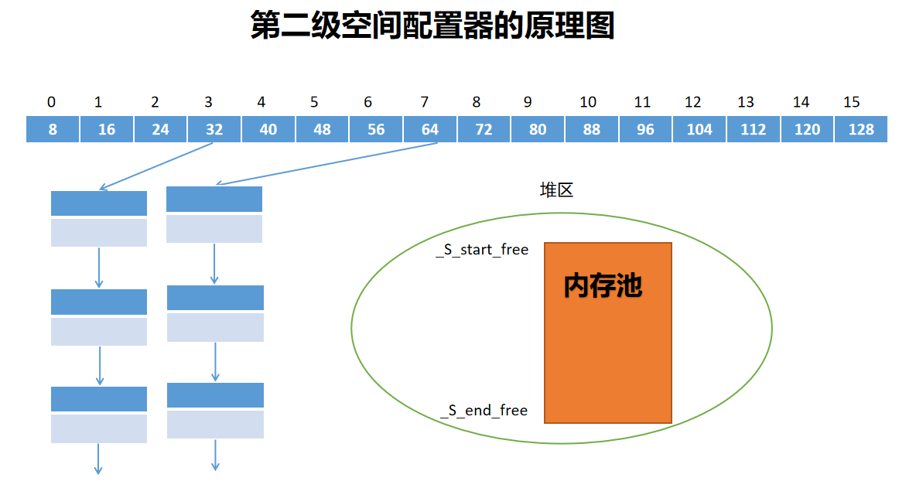
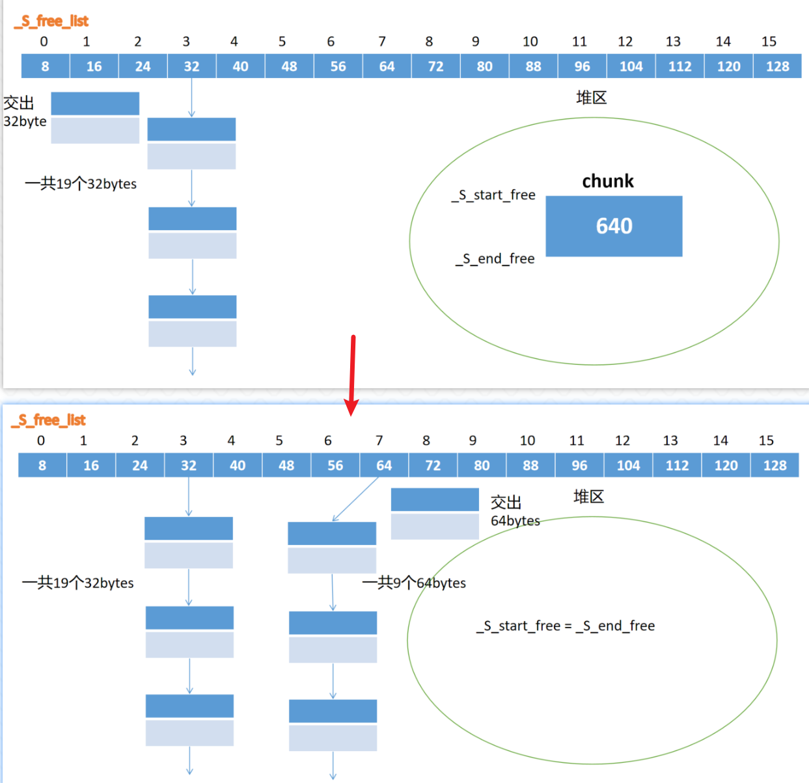
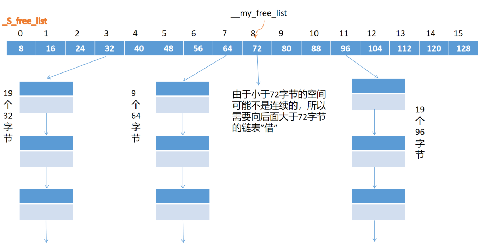

# allocator的基本概念

在C++中所有STL容器的空间分配其实都是使用的`std::allocator`

`std::allocator`是可以感知类型的空间分配器，将空间的申请与对象的构建、以及空间的回收与对象的销毁严格分离。

以前我们知道使用new创建单个对象的时候，空间的申请与对象的构造实际也是分开的（可以回顾new表达式的工作步骤）。

**那么为什么要将空间的申请与对象的构建分开呢？**

1. **减少不必要的对象构造和析构**：在容器的使用过程中，有时只是需要预留一些空间，而并不需要立即在这些空间上构造对象。例如，`std::vector` 的 `reserve` 函数，它的作用是为容器预留足够的内存空间，但不会构造任何对象。如果不将空间申请和对象构建分开，每次预留空间时都会构造对象，之后又可能因为不需要这些对象而进行析构，这会带来不必要的性能开销。
2. **方便实现复杂的容器操作**：在实现容器的一些操作，如插入、删除元素时，将空间申请和对象构建分开可以更方便地处理各种情况。例如，在插入元素时，如果当前空间不足，容器可以先申请新的空间，然后将原有元素移动到新空间，最后在合适的位置构造新的对象，这样的操作更加灵活和高效。（比如`vector`的动态扩容机制背后就使用了空间配置器）

**常用成员函数**

```cpp
//申请空间
T* allocate( std::size_t n );

//释放空间
void deallocate( T* p, std::size_t n );

//构建对象
void construct( pointer p, const_reference val );

//执行析构
void destroy( pointer p );  //p->~T()
```

# 底层实现

## 原理

空间配置器会分为两级：

一级空间配置器使用类模板`malloc_alloc_template` ，其底层使用的是`malloc/free`进行空间的申请与释放；

二级空间配置器使用类模板`default_alloc_template`（默认空间配置器），其底层根据申请空间大小又分为两个分支，第一分支是当申请的空间大于128字节的时候，还是走`malloc_alloc_template` ，当申请的空间小于128字节的使用，使用内存池 + 自由链表的方法申请空间。

**注意：这里提到的自由链表实际是一个容量为16的指针数组，在源码中使用了_S_free_list这个名字，直译为自由链表**

有一个容量为16的指针数组，每个元素（指针）指向一个链表 ，用于管理不同大小的内存块。这 16 个指针所指向的链表，分别对应 8、16、24、32、40、48、52、64、72、80、88、96、104、112、120、128 字节的内存块。

每当程序申请小于 128 字节的内存时，二级空间配置器会先将申请的内存大小上调为 8 的倍数，再根据上调后的大小（8的整数倍）找到对应的链表。

>比如：
>
>数组中下标为3的指针，代表着会按照8 * (3 + 1) = 32字节为基本单位申请空间。
>
>第一次申请32个字节空间的时候，一次性申请很大一片空间（比如32 * 20 = 640个字节），然后按照32字节为一个等分，分成多个等分，然后挂接在下标为3的指针下面，形成链表形式。
>
>以后需要32字节的时候，直接在下标为3的下面取出一个节点即可，就是32个字节的内存空间。
>
>---
>
>如果申请64字节空间，第一次申请时也申请很大一片空间，同样按照64字节为一个等分，分成多个等分，挂载在数组中下标为7的指针之下。
>
>以后如果需要申请64字节时，就在下标为7的下面取出一个节点即可。
>
>其他下标的处理方式完全一致。

自由链表的工作示意图如下,第一次申请空间时比较麻烦，后续再此申请同等大小的空间可以以O(1)的时间复杂度完成申请。



>**这么干有什么意义呢，为什么不每次直接申请相应大小的空间？**
>
>如果频繁申请小片空间，可能会出现内存碎片的问题，这样导致空间的利用率低；
>
>会在内核态与用户态之间进行频繁的切换，时间消耗也比较大。

## 源码

由头文件`<memory> `找到`<stl_alloc.h>`

``` c++
template <class _Tp>
class allocator {
    // 了解到_Alloc类型别名
    typedef alloc _Alloc;

public:
    _Tp *allocate(size_type __n, const void * = 0) {
        // 如果申请空间大小不为0，调用_Alloc的静态成员函数allocate
        // 如果申请空间大小为0，返回空指针
        return __n != 0 ? static_cast<_Tp *>(_Alloc::allocate(__n * sizeof(_Tp))) : nullptr;
    }

    void deallocate(pointer __p, size_type __n) {
        _Alloc::deallocate(__p, __n * sizeof(_Tp));
    }

    void construct(pointer __p, const _Tp &__val) { new (__p) _Tp(__val); }

    void destroy(pointer __p) { __p->~_Tp(); }
};
```

继续查看类型别名原本的定义

``` c++
typedef malloc_alloc alloc;
typedef __malloc_alloc_template<0> malloc_alloc;
```

``` c++
template <int __inst>
class __malloc_alloc_template {
public:
    static void *allocate(size_t __n) {
        // 其实底层就是使用了malloc
        void *__result = malloc(__n);
        if (nullptr == __result)
            __result = _S_oom_malloc(__n); // 申请失败的情况
        return __result;
    }
};
```

**这就是一级空间配置器**

---

回到`typedef alloc _Alloc`; 查找`alloc`时还有第二个分支

``` c++
// 另一个分支的alloc类
typedef __default_alloc_template<__NODE_ALLOCATOR_THREADS, 0> alloc;

// 相当于
#ifdef __USE_MALLOC

typedef malloc_alloc alloc;

#else
typedef __default_alloc_template<__NODE_ALLOCATOR_THREADS, 0> alloc;
#endif
```

查看`__default_alloc_template`的定义(下面对源码进行了一定的简化)

**也就是二级空间配置器**

``` c++
// 主要查看静态成员函数allocate的定义
template <bool threads, int inst>
class __default_alloc_template {
    enum { _ALIGN = 8 };
    enum { _MAX_BYTES = 128 };
    enum { _NFREELISTS = 16 };

    /* __n must be > 0      */
    static void *allocate(size_t __n) {
        void *__ret = nullptr;

        if (__n > 128) { // if (__n > (size_t) _MAX_BYTES){
            //__ret = malloc_alloc::allocate(__n);
            // 又回到刚才的情况了，等价于就是调用了malloc
            __ret = malloc(__n);
        } else {
            // 这一步很关键，跳转查看_S_free_list和_S_freelist_index
            // 从数组开始位置偏移相应长度，接下来可以在这个位置之下挂载内存块节点
            //
            // 假设arr是一个存着int*元素的数组 int * arr[16] = {0}
            // arr int** + 3 就得到了数组中第四个元素的地址
            _Obj **__my_free_list = _S_free_list + _S_freelist_index(__n);

            _Obj *__RESTRICT __result = *__my_free_list;
            if (__result == 0)
                __ret = _S_refill(_S_round_up(__n));
            else {
                *__my_free_list = __result->_M_free_list_link;
                __ret = __result;
            }
        }
        return __ret;
    };
};
```

对于`_S_free_list`，最终其类型为`_obj*[16]`

``` c++
#if defined(__SUNPRO_CC) || defined(__GNUC__) || defined(__HP_aCC)
static _Obj *_S_free_list[];
// Specifying a size results in duplicate def for 4.1
#else
    static _Obj*  _S_free_list[16]; 

template <bool __threads, int __inst>
typename __default_alloc_template<__threads, __inst>::_Obj* __STL_VOLATILE
__default_alloc_template<__threads, __inst> ::_S_free_list[
#if defined(__SUNPRO_CC) || defined(__GNUC__) || defined(__HP_aCC)
    _NFREELISTS
#else
    __default_alloc_template<__threads, __inst>::_NFREELISTS
#endif
] = {0, 0, 0, 0, 0, 0, 0, 0, 0, 0, 0, 0, 0, 0, 0, 0, };
```

对于`_S_freelist_index(__n)`

``` c++
// 假设申请32字节，这里传入的参数就是32
static size_t _S_freelist_index(size_t __bytes) {
    //(32 + 8 - 1)/8 - 1 = 4 - 1 = 3       32字节对应数组中下标为3的位置
    return (((__bytes) + (size_t)_ALIGN - 1) / (size_t)_ALIGN - 1);
}
```

**作用：根据申请内存的大小取其对应于指针数组（自由链表）中的下标**

刚才的`allocate`函数中申请空间大小小于128的分支就可以这样来进行理解

``` c++
// 假设申请32字节，__n = 32
//_S_freelist_index(32) = 3
// 类似于int* arr[16] = {0};
// int **p = arr + 3;
_Obj **__my_free_list = _S_free_list + _S_freelist_index(__n);

// 一开始_S_free_list里存的全都是空指针
//__result = nullptr;
_Obj *__RESTRICT __result = *__my_free_list;
if (__result == nullptr)
    __ret = _S_refill(_S_round_up(__n)); // 跳转查看_S_round_up，再跳转查看_S_refill
else {
    *__my_free_list = __result->_M_free_list_link;
    __ret = __result;
}
```

`_S_round_up`函数

``` c++
static size_t _S_round_up(size_t __bytes) //__bytes = 32
{
    //(32 + 8 - 1) & ~(8 - 1) = 39 & ~7  按位与
    // 39 = 32 + 4 + 2 + 1 ====> 0010 0111
    // 7 = 4 + 2 + 1 ====> 0000 0111  再取反 ~7 = 1111 1000
    // 39 & ~7 = 0010 0000  =====> 就是32
    return (((__bytes) + (size_t)_ALIGN - 1) & ~((size_t)_ALIGN - 1));
}

// 传入的参数是32，返回值也是32，好像有点没必要，那么试试如果传进来的是31
//(31 + 8 - 1) & ~(8 - 1) = 38 & ~7  按位与
// 38 = 32 + 4 + 2 ====> 0010 0110
// 7 = 4 + 2 + 1 ====> 0000 0111  再取反 ~7 = 1111 1000
// 38 & ~7 = 0010 0000  =====> 也是32

// 如果传入的是33
//(33 + 8 - 1) & ~(8 - 1) = 40 & ~7  按位与
// 40 = 32 + 8 ====> 0010 1000
// 7 = 4 + 2 + 1 ====> 0000 0111  再取反 ~7 = 1111 1000
// 40 & ~7 = 0010 1000  =====> 40

// 不妨多试一下参数
// 25 ---> 32
// 24 ---> 24
//...
```

**作用：这个函数实现的就是向上取整得到8的整数倍**

`_S_refill`函数

``` c++
// 仍然根据刚才的假设走，此时传入参数__n = 32
void *__default_alloc_template<__threads, __inst>::_S_refill(size_t __n) {
    int __nobjs = 20;
    //_S_chunk_alloc实际申请了2 * 20 * 32 = 1280字节空间
    //__chunk会指向前640字节的空间的首地址
    char *__chunk = _S_chunk_alloc(__n, __nobjs); //_S_chunk_alloc这个函数才是真正去申请了空间的函数

    _Obj *__STL_VOLATILE *__my_free_list;
    _Obj *__result;
    _Obj *__current_obj;
    _Obj *__next_obj;
    int __i;

    if (1 == __nobjs)
        return (__chunk);

    // 在数组中偏移到下标3位置，接下来32字节的内存块都挂载到这个位置之下
    __my_free_list = _S_free_list + _S_freelist_index(__n);

    /* Build free list in chunk */
    __result = (_Obj *)__chunk;                             // 指向640个字节的最开始，强转成_Obj*类型指针，并且__result作为了最后的返回值，实际上就是把32字节的空间交出来了
    *__my_free_list = __next_obj = (_Obj *)(__chunk + __n); // 从640字节内存首地址偏移32字节，强转成_Obj*类型指针，并用数组中的第四个指针（下标3）进行指向
    for (__i = 1;; __i++) {
        __current_obj = __next_obj;
        __next_obj = (_Obj *)((char *)__next_obj + __n); //__next_obj再偏移32字节
        if (__nobjs - 1 == __i) {                        // 20 - 1 != 1，走else分支 —— 要循环19次，最终把剩下的19 * 32字节切割成32字节等分，一步一步挂载起来
            __current_obj->_M_free_list_link = 0;
            break;
        } else {
            __current_obj->_M_free_list_link = __next_obj; // 用链表连接的方式，从（640-32）剩下的内存块中又切割出32字节
        }
    }
    return (__result);
}
```

**作用：将调用_S_chunk_alloc所返回的640字节以32字节为一个等分，分成20等分，第一等分交给__result直接作为返回值，剩下的19个32字节会以链表的形式挂接在数组中下标为3的元素之下。**

`_S_chunk_alloc`函数

``` c++
template <bool __threads, int __inst>
char *
__default_alloc_template<__threads, __inst>::_S_chunk_alloc(size_t __size, // 32
                                                            int &__nobjs)  // 20
{
    char *__result;
    size_t __total_bytes = __size * __nobjs;           // 640
    size_t __bytes_left = _S_end_free - _S_start_free; // 0 第二次变成1280

    if (__bytes_left >= __total_bytes) {
        __result = _S_start_free;       // 将1280字节的空间交出了640个字节
        _S_start_free += __total_bytes; //_S_start_free和_S_end_free之间只剩640字节空间
        return (__result);
    } else if (__bytes_left >= __size) {
        __nobjs = (int)(__bytes_left / __size);
        __total_bytes = __size * __nobjs;
        __result = _S_start_free;
        _S_start_free += __total_bytes;
        return (__result);
    } else {
        // 第一次得到了__bytes_to_get = 1280
        size_t __bytes_to_get =
            2 * __total_bytes + _S_round_up(_S_heap_size >> 4);
        // Try to make use of the left-over piece.
        if (__bytes_left > 0) {
            _Obj *__STL_VOLATILE *__my_free_list =
                _S_free_list + _S_freelist_index(__bytes_left);

            ((_Obj *)_S_start_free)->_M_free_list_link = *__my_free_list;
            *__my_free_list = (_Obj *)_S_start_free;
        }

        _S_start_free = (char *)malloc(__bytes_to_get); //_S_start_free指向1280字节的首地址

        if (0 == _S_start_free) {
            size_t __i;
            _Obj *__STL_VOLATILE *__my_free_list;
            _Obj *__p;
            // Try to make do with what we have.  That can't
            // hurt.  We do not try smaller requests, since that tends
            // to result in disaster on multi-process machines.
            for (__i = __size;
                 __i <= (size_t)_MAX_BYTES;
                 __i += (size_t)_ALIGN) {
                __my_free_list = _S_free_list + _S_freelist_index(__i);
                __p = *__my_free_list;
                if (0 != __p) {
                    *__my_free_list = __p->_M_free_list_link;
                    _S_start_free = (char *)__p;
                    _S_end_free = _S_start_free + __i;
                    return (_S_chunk_alloc(__size, __nobjs));
                    // Any leftover piece will eventually make it to the
                    // right free list.
                }
            }
            _S_end_free = 0; // In case of exception.
            _S_start_free = (char *)malloc_alloc::allocate(__bytes_to_get);
            // This should either throw an
            // exception or remedy the situation.  Thus we assume it
            // succeeded.
        }
        _S_heap_size += __bytes_to_get;               //_S_heap_size = 1280
        _S_end_free = _S_start_free + __bytes_to_get; //_S_end_free指向1280字节的尾后位置
        return (_S_chunk_alloc(__size, __nobjs));     // 递归调用
    }
}
```

``` c++
template <bool __threads, int __inst>
char *__default_alloc_template<__threads, __inst>::_S_start_free = 0;

template <bool __threads, int __inst>
char *__default_alloc_template<__threads, __inst>::_S_end_free = 0;

template <bool __threads, int __inst>
size_t __default_alloc_template<__threads, __inst>::_S_heap_size = 0;
```

``` c++
union _Obj {
    union _Obj *_M_free_list_link;
    char _M_client_data[1]; // The client sees this.
};
```

再回过头来看`allocate`函数，如果是第二次申请32字节空间，逻辑是怎样的。

``` c++
// 假设申请32字节，__n = 32
//_S_freelist_index(32) = 3
// 同样找到数组下标3位置
_Obj **__my_free_list = _S_free_list + _S_freelist_index(__n);

// 这次_S_free_list的下标3位置存的不是空指针
// 而是还挂载着19个32字节
_Obj *__RESTRICT __result = *__my_free_list;
if (__result == nullptr)
    __ret = _S_refill(_S_round_up(__n)); // 跳转查看_S_round_up，再跳转查看_S_refill
else {
    *__my_free_list = __result->_M_free_list_link; // 让数组中下标3的元素（指针）指向再下一个内存块节点
    __ret = __result;                              // 又交出32字节
}
```

**函数的调用关系图**


现在对自由链表已经有了初步的了解，那么内存池又是什么？

从名字上进行推理，线程池就是先创建一堆的线程备用，内存池应该也是先申请好一片空间备用。回到刚才的`_S_chunk_alloc`函数，这个函数是真正去分配空间的函数。刚才申请32字节空间时，根据源码逻辑是申请了1280个字节堆空间的，但只拿出了640个字节挂接在数组中下标为4的链表中。还有640个字节的空间干什么用？当然是备用的。

根据源码分析，如果接下来又要申请64字节空间会怎样。

``` c++
class __default_alloc_template {
  static void* allocate(size_t __n) //__n = 64
  {
      void* __ret = 0;    
   	  //...
      
      //找到数组中下标为7的位置
      _Obj** __my_free_list = _S_free_list + _S_freelist_index(__n);  
        
      _Obj* __RESTRICT __result = *__my_free_list; //数组下标7位置的元素仍然是空指针   _S_free_list[7] = nullptr;
      if (__result == 0)
          //跳转_S_refill
        __ret = _S_refill(_S_round_up(__n));  //__ret = _S_refill(64);   
      else {
        *__my_free_list = __result -> _M_free_list_link;
        __ret = __result;
      }
    }
    return __ret;
  };
};
```

``` c++
void *__default_alloc_template<__threads, __inst>::_S_refill(size_t __n) {
    int __nobjs = 20;
    // 跳转先只执行完_S_chunk_alloc再看
    char *__chunk = _S_chunk_alloc(__n, __nobjs); // char* __chunk = _S_chunk_alloc(64, 20)
    _Obj *__STL_VOLATILE *__my_free_list;
    _Obj *__result;
    _Obj *__current_obj;
    _Obj *__next_obj;
    int __i;

    if (1 == __nobjs)
        return (__chunk);

    __my_free_list = _S_free_list + _S_freelist_index(__n); // 定位数组下标为7的位置

    /* Build free list in chunk */
    __result = (_Obj *)__chunk;                             // 拿出64字节给__result
    *__my_free_list = __next_obj = (_Obj *)(__chunk + __n); // 640字节首地址偏移64字节后强转，让数组下标7位置的元素指向第二个64字节

    // 接下来的逻辑仍然是切割，将剩下的内存切割成了9个64字节
    for (__i = 1;; __i++) {
        __current_obj = __next_obj;
        __next_obj = (_Obj *)((char *)__next_obj + __n);
        if (__nobjs - 1 == __i) {
            __current_obj->_M_free_list_link = 0;
            break;
        } else {
            __current_obj->_M_free_list_link = __next_obj;
        }
    }
    return (__result);
}
```

``` c++
template <bool __threads, int __inst>
char *__default_alloc_template<__threads, __inst>::_S_start_free = 0;

template <bool __threads, int __inst>
char *__default_alloc_template<__threads, __inst>::_S_end_free = 0;

template <bool __threads, int __inst>
size_t __default_alloc_template<__threads, __inst>::_S_heap_size = 0;

template <bool __threads, int __inst>
char *__default_alloc_template<__threads, __inst>::_S_chunk_alloc(size_t __size, //__size = 64
                                                                  int &__nobjs)  //__nobjs = 20   注意这里形参是引用，在函数中会通过形参改变实参
{
    char *__result;
    size_t __total_bytes = __size * __nobjs; // 64 * 20 = 1280
                                             // 第一次申请32时这个结果为0，所以走的是下面的第三个分支；
    // 接着第一次申请64时这个结果已经是640了,所以应该走下面的第二个分支
    size_t __bytes_left = _S_end_free - _S_start_free;

    if (__bytes_left >= __total_bytes) {
        __result = _S_start_free;
        _S_start_free += __total_bytes;
        return (__result);
    } else if (__bytes_left >= __size) {
        __nobjs = (int)(__bytes_left / __size); // 640/64 = 10  注意这里__nobjs向外影响实参，改变为10
        __total_bytes = __size * __nobjs;       // 64 * 10 = 640
        __result = _S_start_free;
        _S_start_free += __total_bytes; //_S_start_free经过了这样的偏移，实际上就跟_S_end_free指到一起了（代表着内存池里的内存贡献出来了）
        return (__result);              // 这里的逻辑就是把刚才剩余的640字节空间的首地址作为了返回值
    } else {
        size_t __bytes_to_get =
            2 * __total_bytes + _S_round_up(_S_heap_size >> 4);
        //...
    }
}
```



如果接着还要申请64字节（或者57-64范围内的大小），就再从数组中下标7位置对应的链表中再拿一个内存块出来，非常方便。

如果再要申请96个字节，操作方式跟第一次申请32字节一样，在数组下标11的位置下面挂载一些96字节的内存块。

假如接下来某一次要申请72字节，但是内存池和堆空间都没有连续的72字节了。想要使用相同的逻辑再申请空间不会成功，那么会往上借，也就是往数组下标9的位置去找，再没有就往下标10、下标11去找。下标11下面挂载着内存块，从中去除96字节的块，进行切割，获取72字节，剩24字节作为内存池中的内存。




目前为止，只是解决了`allocate`的问题，再来看看`deallocate`函数

如果是一级空间配置器，其背后就是调用`free`释放空间

如果是二级空间配置器，对应找到这个函数

``` c++
static void deallocate(void *__p, size_t __n) //__p就是某个内存节点的首地址，__n就是要回收的内存块大小
{
    if (__n > 128)
        malloc_alloc::deallocate(__p, __n); // 底层还是free
    else {
        // 假设回收32字节，这一步就是定位到数组中下标3位置
        _Obj **__my_free_list = _S_free_list + _S_freelist_index(__n);
        _Obj *__q = (_Obj *)__p;

        // 其实是把刚刚用完的32个字节又挂接到链表的头上去了，就是一个还原的操作逻辑
        __q->_M_free_list_link = *__my_free_list;
        *__my_free_list = __q;
    }
}
```

通过`deallocate`的逻辑我们也能理解一件事情 —— 为什么刚才需要72字节空间时要往上借到96字节，而不是往下借（比如更近的2 * 64，借两块）

因为这些链表中的内存块节点并不一定是连续的。虽然刚开始申请时是连续空间，但是用了一些内存块，又还了一些内存块后，链表连接的两块内存块就不一定连续了。


再看看构建对象的函数和销毁对象的函数

``` c++
template <class _Tp>
class allocator {
    void construct(pointer __p, const _Tp &__val) {
        // 定位new表达式，在指定的空间上构建对象
        new (__p) _Tp(__val);
    }

    void destroy(pointer __p) {
        // 调用析构
        __p->~_Tp();
    }
};
```

总结函数的功能：

1. `_S_freelist_index`函数的作用在自由链表中取下标
2. `_S_round_up`函数的作用向上取整，得到8的整数倍
3. `allocate`对外是申请空间的函数，但是底层会调用`_S_refill`，但是`_S_refill`也不会申请空间，该函数会调用`_S_chunk_alloc`函数。
4. `_S_chunk_alloc`函数才是真正的申请空间的函数，并且该函数有可能会造成调用，会将其中的一部分返回给`_S_refill`，另外一部分会交给内存中的两个指针`_S_start_free`与`_S_end_free`，以备下一次申请的时候使用
5. `_S_refill`函数会将`_S_chunk_alloc`函数返回的空间进行切割，会切割成多个等分，并接在对应的自由链表的下面。


