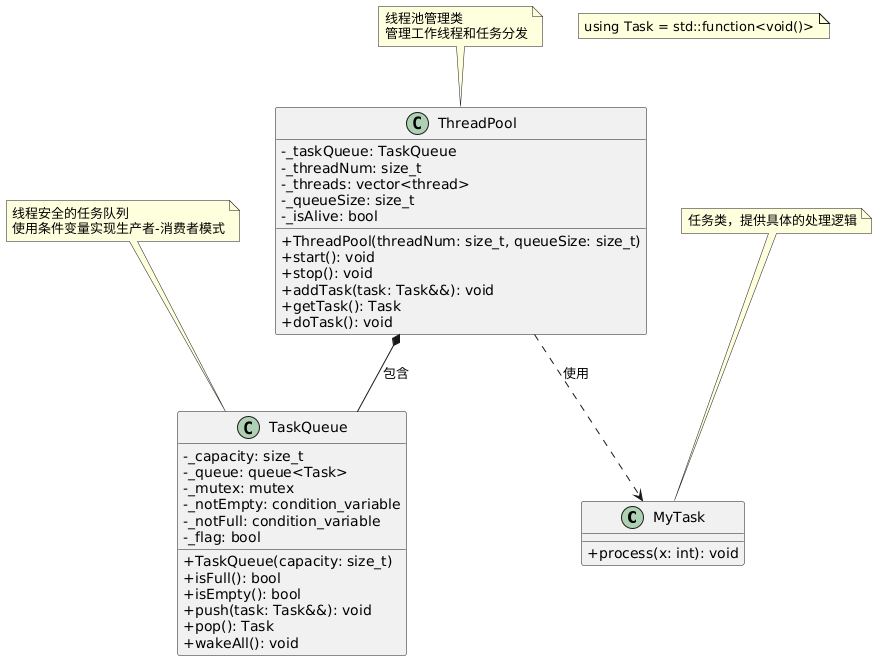

# 线程

## 线程创建

C++11引入了强大的多线程支持，主要通过`<thread>`头文件提供。以下是详细介绍：

**使用函数创建线程**

```cpp
#include <iostream>
#include <thread>

void hello() {
    std::cout << "Hello from thread!" << std::endl;
}

int main() {
    std::thread t(hello);  // 创建线程
    t.join();              // 等待线程完成
    return 0;
}
```

**使用Lambda表达式**

```cpp
#include <iostream>
#include <thread>

int main() {
    std::thread t([]() {
        std::cout << "Lambda thread!" << std::endl;
    });
    t.join();
    return 0;
}
```

**使用类成员函数**

```cpp
#include <iostream>
#include <thread>

class MyClass {
public:
    void member_function() {
        std::cout << "Member function thread!" << std::endl;
    }
};

int main() {
    MyClass obj;
    std::thread t(&MyClass::member_function, &obj);
    t.join();
    return 0;
}
```

## 线程管理

**join() 和 detach()**

```cpp
#include <iostream>
#include <thread>
#include <chrono>

void worker() {
    std::this_thread::sleep_for(std::chrono::seconds(2));
    std::cout << "Worker finished" << std::endl;
}

int main() {
    std::thread t(worker);
    
    // 选择一种方式：
    t.join();    // 等待线程完成
    // 或者
    // t.detach(); // 分离线程，让它独立运行
    
    return 0;
}
```

**检查线程状态**

```cpp
#include <iostream>
#include <thread>

int main() {
    std::thread t([]() {
        std::cout << "Thread running" << std::endl;
    });
    
    if (t.joinable()) {
        std::cout << "Thread is joinable" << std::endl;
        t.join();
    }
    
    return 0;
}
```

## 线程参数传递

**按值传递**

```cpp
#include <iostream>
#include <thread>

void print_value(int x, std::string str) {
    std::cout << "Value: " << x << ", String: " << str << std::endl;
}

int main() {
    int num = 42;
    std::string text = "Hello";
    
    std::thread t(print_value, num, text);
    t.join();
    
    return 0;
}
```

**按引用传递**

```cpp
#include <iostream>
#include <thread>

void modify_value(int& x) {
    x = 100;
}

int main() {
    int num = 42;
    
    // 使用std::ref传递引用
    std::thread t(modify_value, std::ref(num));
    t.join();
    
    std::cout << "Modified value: " << num << std::endl; // 输出100
    
    return 0;
}
```


# 锁

## 基础锁类型

### 互斥锁

`std::mutex`是最基本的互斥锁，同一时间只允许一个线程访问。

```cpp
#include <iostream>
#include <thread>
#include <mutex>

std::mutex mtx;
int counter = 0;

void increment() {
    for (int i = 0; i < 1000; ++i) {
        mtx.lock();    // 加锁
        ++counter;
        mtx.unlock();  // 解锁
    }
}

int main() {
    std::thread t1(increment);
    std::thread t2(increment);
    
    t1.join();
    t2.join();
    
    std::cout << "Counter: " << counter << std::endl;
    return 0;
}
```

### 递归互斥锁

`std::recursive_mutex`允许同一线程多次获取同一个锁。

```cpp
#include <iostream>
#include <thread>
#include <mutex>

std::recursive_mutex rec_mtx;

void recursive_function(int depth) {
    rec_mtx.lock();
    
    std::cout << "Depth: " << depth << std::endl;
    
    if (depth > 0) {
        recursive_function(depth - 1);  // 同一线程再次获取锁
    }
    
    rec_mtx.unlock();
}

int main() {
    std::thread t(recursive_function, 3);
    t.join();
    return 0;
}
```

### 定时互斥锁

`std::timed_mutex`是支持超时的互斥锁。

```cpp
#include <iostream>
#include <thread>
#include <mutex>
#include <chrono>

std::timed_mutex timed_mtx;

void worker(int id) {
    // 尝试在2秒内获取锁
    if (timed_mtx.try_lock_for(std::chrono::seconds(2))) {
        std::cout << "Thread " << id << " got the lock" << std::endl;
        std::this_thread::sleep_for(std::chrono::seconds(3));
        timed_mtx.unlock();
    } else {
        std::cout << "Thread " << id << " timeout" << std::endl;
    }
}

int main() {
    std::thread t1(worker, 1);
    std::thread t2(worker, 2);
    
    t1.join();
    t2.join();
    
    return 0;
}
```

### 递归定时互斥锁

`std::recursive_timed_mutex`是结合了递归和定时功能的互斥锁。

```cpp
std::recursive_timed_mutex rec_timed_mtx;

void timed_recursive_function(int depth) {
    if (rec_timed_mtx.try_lock_for(std::chrono::milliseconds(100))) {
        std::cout << "Depth: " << depth << std::endl;
        
        if (depth > 0) {
            timed_recursive_function(depth - 1);
        }
        
        rec_timed_mtx.unlock();
    }
}
```

## 锁管理器

### lock_guard

最简单的RAII锁管理器，构造时加锁，析构时自动解锁。

```cpp
#include <iostream>
#include <thread>
#include <mutex>

std::mutex mtx;
int shared_data = 0;

void safe_increment() {
    std::lock_guard<std::mutex> lock(mtx);  // 自动加锁
    ++shared_data;
    // 函数结束时自动解锁
}

void risky_function() {
    std::lock_guard<std::mutex> lock(mtx);
    ++shared_data;
    
    if (shared_data > 5) {
        throw std::runtime_error("Error!");  // 异常时也会自动解锁
    }
}

int main() {
    std::vector<std::thread> threads;
    
    for (int i = 0; i < 10; ++i) {
        threads.emplace_back(safe_increment);
    }
    
    for (auto& t : threads) {
        t.join();
    }
    
    std::cout << "Shared data: " << shared_data << std::endl;
    return 0;
}
```

### unique_lock

更灵活的锁管理器，支持延迟加锁、条件变量等。

```cpp
#include <iostream>
#include <thread>
#include <mutex>
#include <condition_variable>

std::mutex mtx;
std::condition_variable cv;
bool ready = false;

void worker() {
    std::unique_lock<std::mutex> lock(mtx);
    
    // 等待条件满足
    cv.wait(lock, []{ return ready; });
    
    std::cout << "Worker thread proceeding..." << std::endl;
}

void setter() {
    std::this_thread::sleep_for(std::chrono::seconds(1));
    
    {
        std::unique_lock<std::mutex> lock(mtx);
        ready = true;
    }
    
    cv.notify_one();
}

// 手动控制锁的示例
void flexible_locking() {
    std::unique_lock<std::mutex> lock(mtx, std::defer_lock);  // 延迟加锁
    
    // 做一些不需要锁的工作
    std::this_thread::sleep_for(std::chrono::milliseconds(100));
    
    lock.lock();  // 手动加锁
    // 临界区代码
    lock.unlock();  // 手动解锁
    
    // 做更多不需要锁的工作
    std::this_thread::sleep_for(std::chrono::milliseconds(100));
    
    lock.lock();  // 再次加锁
    // 更多临界区代码
    // 析构时自动解锁
}
```

### shared_lock

用于读写锁的共享锁定。

```cpp
#include <iostream>
#include <thread>
#include <shared_mutex>  // C++14
#include <vector>

std::shared_mutex rw_mutex;
int shared_data = 0;

void reader(int id) {
    std::shared_lock<std::shared_mutex> lock(rw_mutex);  // 共享锁
    std::cout << "Reader " << id << " reads: " << shared_data << std::endl;
    std::this_thread::sleep_for(std::chrono::milliseconds(100));
}

void writer(int id) {
    std::unique_lock<std::shared_mutex> lock(rw_mutex);  // 独占锁
    ++shared_data;
    std::cout << "Writer " << id << " writes: " << shared_data << std::endl;
    std::this_thread::sleep_for(std::chrono::milliseconds(100));
}
```

## 避免死锁

同时锁定多个互斥锁，避免死锁。

```cpp
#include <iostream>
#include <thread>
#include <mutex>

std::mutex mtx1, mtx2;

void worker1() {
    std::lock(mtx1, mtx2);  // 同时锁定两个互斥锁
    std::lock_guard<std::mutex> lock1(mtx1, std::adopt_lock);
    std::lock_guard<std::mutex> lock2(mtx2, std::adopt_lock);
    
    std::cout << "Worker 1 acquired both locks" << std::endl;
    std::this_thread::sleep_for(std::chrono::milliseconds(100));
}

void worker2() {
    std::lock(mtx2, mtx1);  // 不同的顺序，但不会死锁
    std::lock_guard<std::mutex> lock1(mtx2, std::adopt_lock);
    std::lock_guard<std::mutex> lock2(mtx1, std::adopt_lock);
    
    std::cout << "Worker 2 acquired both locks" << std::endl;
    std::this_thread::sleep_for(std::chrono::milliseconds(100));
}

int main() {
    std::thread t1(worker1);
    std::thread t2(worker2);
    
    t1.join();
    t2.join();
    
    return 0;
}
```

```cpp
// 策略1：固定顺序获取锁
void fixed_order_locking() {
    // 总是按照地址顺序获取锁
    std::mutex* first = &mtx1 < &mtx2 ? &mtx1 : &mtx2;
    std::mutex* second = &mtx1 < &mtx2 ? &mtx2 : &mtx1;
    
    std::lock_guard<std::mutex> lock1(*first);
    std::lock_guard<std::mutex> lock2(*second);
}

// 策略2：使用std::lock
void simultaneous_locking() {
    std::lock(mtx1, mtx2);
    std::lock_guard<std::mutex> lock1(mtx1, std::adopt_lock);
    std::lock_guard<std::mutex> lock2(mtx2, std::adopt_lock);
}

// 策略3：使用超时
void timeout_locking() {
    std::unique_lock<std::timed_mutex> lock1(timed_mtx);
    
    if (auto lock2 = std::unique_lock<std::timed_mutex>(timed_mtx, std::try_to_lock)) {
        // 成功获取两个锁
    } else {
        // 处理获取锁失败的情况
    }
}
```

## try_lock系列

非阻塞的锁获取尝试。

```cpp
#include <iostream>
#include <thread>
#include <mutex>

std::mutex mtx;

void try_lock_example() {
    if (mtx.try_lock()) {
        std::cout << "Got the lock!" << std::endl;
        std::this_thread::sleep_for(std::chrono::seconds(1));
        mtx.unlock();
    } else {
        std::cout << "Failed to get the lock" << std::endl;
    }
}

void try_lock_multiple() {
    std::mutex mtx1, mtx2, mtx3;
    
    // 尝试同时获取多个锁
    int result = std::try_lock(mtx1, mtx2, mtx3);
    
    if (result == -1) {
        // 成功获取所有锁
        std::cout << "Got all locks" << std::endl;
        mtx1.unlock();
        mtx2.unlock();
        mtx3.unlock();
    } else {
        std::cout << "Failed at lock " << result << std::endl;
    }
}
```

## 锁的构造选项

### defer_lock

延迟加锁，构造时不立即获取锁。

```cpp
std::mutex mtx;

void deferred_locking() {
    std::unique_lock<std::mutex> lock(mtx, std::defer_lock);
    
    // 做一些不需要锁的工作
    std::this_thread::sleep_for(std::chrono::milliseconds(100));
    
    lock.lock();  // 现在才获取锁
    // 临界区代码
}
```

### try_to_lock

尝试获取锁，不阻塞。

```cpp
void try_to_lock_example() {
    std::unique_lock<std::mutex> lock(mtx, std::try_to_lock);
    
    if (lock.owns_lock()) {
        std::cout << "Successfully acquired lock" << std::endl;
        // 临界区代码
    } else {
        std::cout << "Failed to acquire lock" << std::endl;
    }
}
```

### adopt_lock

接管已经获取的锁。

```cpp
void adopt_lock_example() {
    mtx.lock();  // 手动获取锁
    
    std::lock_guard<std::mutex> lock(mtx, std::adopt_lock);  // 接管锁
    
    // 临界区代码
    // lock析构时会自动释放锁
}
```

## 锁的性能对比

| 锁类型          | 性能 | 特性     | 使用场景     |
| --------------- | ---- | -------- | ------------ |
| mutex           | 高   | 基础互斥 | 一般同步     |
| recursive_mutex | 中   | 递归锁定 | 递归函数     |
| timed_mutex     | 中   | 超时机制 | 需要超时控制 |
| shared_mutex    | 中   | 读写分离 | 读多写少     |

# 条件变量

C++中使用条件变量可以使用`std::condition_variable`。

```cpp
#include <iostream>
#include <thread>
#include <mutex>
#include <condition_variable>
#include <queue>

std::mutex mtx;
std::condition_variable cv;
std::queue<int> data_queue;
bool finished = false;

void producer() {
    for (int i = 0; i < 10; ++i) {
        std::unique_lock<std::mutex> lock(mtx);
        data_queue.push(i);
        std::cout << "Produced: " << i << std::endl;
        cv.notify_one(); // 通知等待的线程
    }
    
    std::unique_lock<std::mutex> lock(mtx);
    finished = true;
    cv.notify_all();
}

void consumer() {
    while (true) {
        std::unique_lock<std::mutex> lock(mtx);
        
        // 等待条件满足
        cv.wait(lock, []() { return !data_queue.empty() || finished; });
        
        while (!data_queue.empty()) {
            int value = data_queue.front();
            data_queue.pop();
            std::cout << "Consumed: " << value << std::endl;
        }
        
        if (finished) break;
    }
}

int main() {
    std::thread prod(producer);
    std::thread cons(consumer);
    
    prod.join();
    cons.join();
    
    return 0;
}
```

# Atomic类型

**实现原理：**

CAS机制：会将变量的预期值A与在内存中的值V进行比较，如果V与A是相等，就可以将该值改为B；如果V与A的值是不相等，那么就不能将其改为新值B。

```cpp
#include <iostream>
#include <thread>
#include <atomic>

std::atomic<int> atomic_counter(0);

void atomic_increment() {
    for (int i = 0; i < 1000; ++i) {
        atomic_counter++; // 原子操作，无需显式锁
    }
}

int main() {
    std::thread t1(atomic_increment);
    std::thread t2(atomic_increment);
    
    t1.join();
    t2.join();
    
    std::cout << "Atomic counter: " << atomic_counter << std::endl;
    
    return 0;
}
```

# 生产者与消费者模型

## 类图


## 代码

```cpp
#include <condition_variable>
#include <functional>
#include <iostream>
#include <mutex>
#include <queue>
#include <thread>

using std::condition_variable;
using std::cout;
using std::endl;
using std::mutex;
using std::queue;
using std::thread;
using std::unique_lock;

class TaskQueue {
public:
    TaskQueue(size_t capacity) : _capacity(capacity) {}
    bool isFull() {
        return _queue.size() >= _capacity;
    }
    bool isEmpty() {
        return _queue.empty();
    }
    void push(const int &value) {
        unique_lock<mutex> ul{_mutex};
        while (isFull()) {
            _notFull.wait(ul);
        }
        _queue.push(value);
        cout << "生产" << value << endl
             << "--------" << endl;
        _notEmpty.notify_one();
    }
    int pop() {
        unique_lock<mutex> ul{_mutex};
        while (isEmpty()) {
            _notEmpty.wait(ul);
        }
        int temp = _queue.front();
        _queue.pop();
        cout << "消费" << temp << endl
             << "--------" << endl;
        _notFull.notify_one();
        return temp;
    }

private:
    size_t _capacity;
    queue<int> _queue;
    mutex _mutex;
    condition_variable _notEmpty;
    condition_variable _notFull;
};

class Producer {
public:
    void produce(TaskQueue &taskQueue) {
        srand(clock());
        int i = 10;
        while (i--) {
            taskQueue.push(rand() % 100);
        }
    }
};

class Consumer {
public:
    void consume(TaskQueue &taskQueue) {
        int i = 10;
        while (i--) {
            taskQueue.pop();
        }
    }
};

int main(int argc, char *argv[]) {
    TaskQueue taskQueue{5};
    Producer producer;
    Consumer consumer;
    thread producerThread{&Producer::produce, &producer, std::ref(taskQueue)};
    thread consumerThread{&Consumer::consume, &consumer, std::ref(taskQueue)};

    producerThread.join();
    consumerThread.join();
    return 0;
}
```

## 说明

**TaskQueue（任务队列）**

- **私有成员**：
  - `_capacity`: 队列容量
  - `_queue`: 存储整数的队列
  - `_mutex`: 互斥锁
  - `_notEmpty`, `_notFull`: 条件变量
- **公有方法**：
  - 构造函数、判空判满、入队出队操作

**Producer（生产者）**

- 包含 `produce()` 方法，向队列生产数据

**Consumer（消费者）**

- 包含 `consume()` 方法，从队列消费数据

# 面向对象的线程池

## 类图


## 代码

```cpp
#include <condition_variable>
#include <functional>
#include <iostream>
#include <memory>
#include <mutex>
#include <queue>
#include <thread>
#include <vector>

using std::condition_variable;
using std::cout;
using std::endl;
using std::mutex;
using std::queue;
using std::thread;
using std::unique_lock;
using std::unique_ptr;
using std::vector;

class Task {
public:
    virtual void process() = 0;
    virtual ~Task() {}
};

class TaskQueue {
public:
    TaskQueue(size_t capacity) : _capacity(capacity) {}
    bool isFull() {
        return _queue.size() >= _capacity;
    }
    bool isEmpty() {
        return _queue.empty();
    }
    void push(Task *task) {
        unique_lock<mutex> ul{_mutex};
        while (isFull()) {
            _notFull.wait(ul);
        }
        _queue.push(task);
        _notEmpty.notify_one();
    }
    Task *pop() {
        unique_lock<mutex> ul{_mutex};
        while (isEmpty() && _flag) {
            _notEmpty.wait(ul);
        }
        if (_flag) {
            Task *temp = _queue.front();
            _queue.pop();
            _notFull.notify_one();
            return temp;
        }
        return nullptr;
    }
    void wakeAll() {
        _flag = false;
        _notEmpty.notify_all();
    }

private:
    size_t _capacity;
    queue<Task *> _queue;
    mutex _mutex;
    condition_variable _notEmpty;
    condition_variable _notFull;
    bool _flag = true;
};

class ThreadPool {
public:
    ThreadPool(size_t threadNum, size_t queueSize)
        : _threadNum(threadNum),
          _taskQueue(queueSize),
          _queueSize(queueSize) {}
    void start() {
        for (int i = 0; i < _threadNum; ++i) {
            _threads.push_back(thread{&ThreadPool::doTask, this});
        }
    }
    void stop() {
        while (!_taskQueue.isEmpty()) {
            std::this_thread::sleep_for(std::chrono::seconds(1));
        }
        _isAlive = false;
        _taskQueue.wakeAll();
        for (auto &th : _threads) {
            th.join();
        }
    }
    void addTask(Task *task) {
        if (task) {
            _taskQueue.push(task);
        }
    }
    Task *getTask() {
        return _taskQueue.pop();
    }
    void doTask() {
        while (_isAlive) {
            Task *task = getTask();
            if (task && _isAlive) {
                task->process();
            }
        }
    }

private:
    TaskQueue _taskQueue;
    size_t _threadNum;
    vector<thread> _threads;
    size_t _queueSize;
    bool _isAlive = true;
};

int taskNum = 1;
mutex mtx;

class Task1 : public Task {
public:
    void process() override {
        unique_lock<mutex> ul{mtx};
        cout << "任务" << taskNum++ << endl;
    }
};

class Task2 : public Task {
public:
    void process() override {
        // 任务2
    }
};

int main(int argc, char *argv[]) {
    ThreadPool pool{3, 10};
    pool.start();
    vector<unique_ptr<Task>> tasks;
    int i = 20;
    while (i--) {
        unique_ptr<Task> task{new Task1};
        pool.addTask(task.get());
        tasks.push_back(std::move(task));
        cout << i << endl;
    }
    pool.stop();
    return 0;
}
```

## 说明

**1. Task（抽象基类）**

- 类型 : 抽象基类
- 方法 :
  - `process()` : 纯虚函数，定义任务处理接口
  - `~Task()` : 虚析构函数，确保正确的多态析构

---

**2. TaskQueue（任务队列）**

- 私有成员 :
  
  - `_capacity` : 队列容量限制
  - `_queue` : 存储Task指针的队列
  - `_mutex` : 互斥锁，保护共享资源
  - `_notEmpty` : 条件变量，通知队列非空
  - `_notFull` : 条件变量，通知队列未满
  - `_flag` : 布尔标志，控制队列状态
- 公有方法 :
  
  - `TaskQueue(size_t capacity)` : 构造函数
  - `isFull()` : 检查队列是否已满
  - `isEmpty()` : 检查队列是否为空
  - `push(Task *task)` : 添加任务（阻塞式）
  - `pop()` : 获取任务（阻塞式）
  - `wakeAll()` : 唤醒所有等待线程

---

**3. ThreadPool（线程池）**

- 私有成员 :
  
  - `_taskQueue` : 任务队列实例
  - `_threadNum` : 线程数量
  - `_threads` : 工作线程容器
  - `_queueSize` : 队列大小
  - `_isAlive` : 线程池状态标志
- 公有方法 :
  
  - `ThreadPool(size_t threadNum, size_t queueSize)` : 构造函数
  - `start()` : 启动线程池
  - `stop()` : 停止线程池
  - `addTask(Task *task)` : 添加任务
  - `getTask()` : 获取任务
  - `doTask()` : 工作线程执行函数

---

**4. Task1和Task2（具体任务实现）**

- `Task1` : 实现了 `process()` 方法，输出任务编号
- `Task2` : 实现了 `process()` 方法，当前为空实现

# 基于对象的线程池

## 类图



## 代码

```cpp
#include <chrono>
#include <condition_variable>
#include <cstdlib>
#include <ctime>
#include <functional>
#include <iostream>
#include <memory>
#include <mutex>
#include <queue>
#include <thread>
#include <vector>

using std::condition_variable;
using std::cout;
using std::endl;
using std::mutex;
using std::queue;
using std::thread;
using std::unique_lock;
using std::unique_ptr;
using std::vector;

using Task = std::function<void()>;

class MyTask {
public:
    void process(int x) {
        // 参数无作用，通过bind绑定改变调用形式
        srand(clock());
        int num = rand() % 100;
        cout << "MyTask::process(): " << num << endl;
    }
};

class TaskQueue {
public:
    TaskQueue(size_t capacity) : _capacity(capacity) {}
    bool isFull() {
        return _queue.size() >= _capacity;
    }
    bool isEmpty() {
        return _queue.empty();
    }
    void push(Task &&task) {
        unique_lock<mutex> ul{_mutex};
        while (isFull()) {
            _notFull.wait(ul);
        }
        _queue.push(std::move(task));
        _notEmpty.notify_one();
    }
    Task pop() {
        unique_lock<mutex> ul{_mutex};
        while (isEmpty() && _flag) {
            _notEmpty.wait(ul);
        }
        if (_flag && !_queue.empty()) {
            Task temp = std::move(_queue.front());
            _queue.pop();
            _notFull.notify_one();
            return temp;
        }
        return Task{};
    }
    void wakeAll() {
        _flag = false;
        _notEmpty.notify_all();
    }

private:
    size_t _capacity;
    queue<Task> _queue;
    mutex _mutex;
    condition_variable _notEmpty;
    condition_variable _notFull;
    bool _flag = true;
};

class ThreadPool {
public:
    ThreadPool(size_t threadNum, size_t queueSize)
        : _threadNum(threadNum),
          _taskQueue(queueSize),
          _queueSize(queueSize) {}
    void start() {
        for (int i = 0; i < _threadNum; ++i) {
            _threads.push_back(thread{&ThreadPool::doTask, this});
        }
    }
    void stop() {
        while (!_taskQueue.isEmpty()) {
            std::this_thread::sleep_for(std::chrono::seconds(1));
        }
        _isAlive = false;
        _taskQueue.wakeAll();
        for (auto &th : _threads) {
            th.join();
        }
    }
    void addTask(Task &&task) {
        if (task) {
            _taskQueue.push(std::move(task));
        }
    }
    Task getTask() {
        return _taskQueue.pop();
    }
    void doTask() {
        while (_isAlive) {
            Task task = getTask();
            if (task && _isAlive) {
                task();
            }
        }
    }

private:
    TaskQueue _taskQueue;
    size_t _threadNum;
    vector<thread> _threads;
    size_t _queueSize;
    bool _isAlive = true;
};

int main(int argc, char *argv[]) {
    unique_ptr<MyTask> task(new MyTask);
    ThreadPool pool{3, 10};
    pool.start();
    int count = 20;
    while (count--) {
        pool.addTask(std::bind(&MyTask::process, task.get(), 1));
    }
    pool.stop();
    return 0;
}
```

## 说明
### 类

**1. Task 类型别名**

```cpp
using Task = std::function<void()>;
```

- **作用**：定义任务的统一接口
- **特点**：可以封装任何无参数、无返回值的可调用对象
- **支持**：函数指针、lambda 表达式、std::bind 绑定的函数对象等

---

**2. MyTask 类**

**功能**：具体的任务实现类，演示如何创建可执行的任务。

**核心方法**：
- `process(int x)`：任务的具体执行逻辑
  - 生成随机数并输出
  - 参数 x 在此实现中无实际作用，主要用于演示 std::bind 的使用

---

**3. TaskQueue 类**

**功能**：线程安全的任务队列，实现生产者-消费者模式。

**私有成员**

- `_capacity`：队列最大容量
- `_queue`：存储任务的队列容器
- `_mutex`：保护队列的互斥锁
- `_notEmpty`：队列非空条件变量
- `_notFull`：队列未满条件变量
- `_flag`：控制队列状态的标志位

**公有方法**

**构造函数**
```cpp
TaskQueue(size_t capacity)
```
- 初始化指定容量的任务队列

**状态查询**
```cpp
bool isFull()    // 检查队列是否已满
bool isEmpty()   // 检查队列是否为空
```

**任务操作**
```cpp
void push(Task &&task)  // 添加任务到队列
Task pop()              // 从队列取出任务
void wakeAll()          // 唤醒所有等待线程并停止队列
```

**线程安全机制**

1. **互斥访问**：使用 `std::mutex` 保护队列操作
2. **条件等待**：
   - 队列满时，生产者线程等待 `_notFull` 条件
   - 队列空时，消费者线程等待 `_notEmpty` 条件
3. **优雅退出**：通过 `_flag` 标志位控制线程退出

---

**4. ThreadPool 类**

**功能**：线程池管理器，负责线程生命周期和任务分发。

**私有成员**

- `_taskQueue`：任务队列实例
- `_threadNum`：线程池中的线程数量
- `_threads`：存储工作线程的容器
- `_queueSize`：任务队列大小
- `_isAlive`：线程池运行状态标志

**公有方法**

**构造函数**
```cpp
ThreadPool(size_t threadNum, size_t queueSize)
```
- `threadNum`：工作线程数量
- `queueSize`：任务队列容量

**生命周期管理**
```cpp
void start()  // 启动线程池
void stop()   // 停止线程池
```

**任务管理**
```cpp
void addTask(Task &&task)  // 添加任务到线程池
Task getTask()             // 获取待执行任务
void doTask()              // 工作线程的主循环
```

### 工作流程

**1. 初始化阶段**

1. 创建 `ThreadPool` 实例，指定线程数和队列大小
2. 调用 `start()` 方法启动指定数量的工作线程
3. 每个工作线程执行 `doTask()` 方法，进入任务等待循环

**2. 任务执行阶段**

1. 主线程通过 `addTask()` 添加任务到队列
2. 工作线程从队列中获取任务并执行
3. 使用条件变量实现高效的线程同步

**3. 关闭阶段**

1. 等待队列中的所有任务执行完成
2. 设置 `_isAlive = false` 停止接收新任务
3. 调用 `wakeAll()` 唤醒所有等待的工作线程
4. 等待所有工作线程结束（`join()`）

