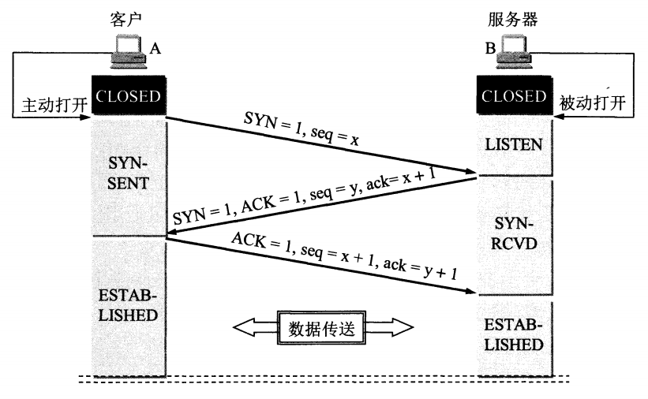

# 分层模型

- **TCP/IP 四层模型**：简洁，适合描述 TCP/IP 协议栈的整体功能，较少使用。
- **TCP/IP 五层模型**：比四层模型更详细，适合描述网络通信的具体实现细节。
- **OSI 七层模型**：理论性更强，适合教学和理论研究，实际应用中较少直接使用。

## OSI七层模型

**1. 物理层（Physical Layer）**

- **作用**：负责在物理媒体上传输原始的比特流
- **功能**：定义电气特性、机械特性、功能特性和过程特性
- **设备**：集线器、中继器、网线、光纤等

**2. 数据链路层（Data Link Layer）**

- **作用**：在相邻节点间提供可靠的数据传输
- **功能**：帧同步、差错控制、流量控制、MAC地址寻址
- **设备**：交换机、网桥
- **协议**：以太网、PPP、HDLC等

**3. 网络层（Network Layer）**

- **作用**：实现不同网络间的路径选择和数据转发
- **功能**：IP地址寻址、路由选择、分组转发
- **设备**：路由器
- **协议**：IP、ICMP、ARP、OSPF、BGP等

**4. 传输层（Transport Layer）**

- **作用**：提供端到端的可靠数据传输服务
- **功能**：分段与重组、错误恢复、流量控制、端口寻址
- **协议**：TCP（可靠传输）、UDP（不可靠传输）

**5. 会话层（Session Layer）**

- **作用**：建立、管理和终止应用程序间的会话
- **功能**：会话建立、会话管理、会话恢复
- **协议**：NetBIOS、RPC、SQL等

**6. 表示层（Presentation Layer）**

- **作用**：数据格式转换、加密解密、压缩解压
- **功能**：数据编码、数据加密、数据压缩
- **协议**：SSL/TLS、JPEG、MPEG、ASCII等

**7. 应用层（Application Layer）**

- **作用**：为用户应用程序提供网络服务接口
- **功能**：网络服务、用户接口
- **协议**：HTTP、HTTPS、FTP、SMTP、DNS、DHCP等

## TCP/IP四层模型

**1. 网络接口层（Network Interface Layer）**

- **对应OSI**：物理层 + 数据链路层
- **作用**：处理与物理网络的连接细节

**2. 网络层（Internet Layer）**

- **对应OSI**：网络层
- **作用**：处理分组在网络中的活动，如路由选择
- **主要协议**：IP、ICMP、ARP

**3. 传输层（Transport Layer）**

- **对应OSI**：传输层
- **作用**：提供端到端的通信服务
- **主要协议**：TCP、UDP

**4. 应用层（Application Layer）**

- **对应OSI**：会话层 + 表示层 + 应用层
- **作用**：包含所有的高层协议
- **主要协议**：HTTP、FTP、SMTP、DNS等

>TCP/IP协议栈的工作原理
>
>- 当发送端的应用程序要发送数据时，数据首先从应用层开始，自上而下依次经过传输层、网络层、数据链路层和物理层。在每一层，数据都会被添加相应的头部信息，这些头部信息包含了该层协议所需的控制信息，如源端口号、目标端口号、源 IP 地址、目标 IP 地址等。
>- 经过各层的处理后，数据最终以比特流的形式通过物理介质发送到网络上。
>- 接收端则按照相反的顺序，从物理层开始，自下而上依次经过各层。每一层在接收到数据后，会根据头部信息进行相应的处理，去除本层添加的头部信息，并将剩余的数据传递给上一层，直到数据到达应用层，被应用程序接收和处理。

# 协议

## 协议的概念

协议，即网络协议的简称，网络协议是通信计算机双方必须共同遵从的一组约定（通信双方需要遵守的规则）。

比如A、B之间传输文件，指定一套规则：假设规则要求第一次传文件名、第二次传文件大小、第三次传文件内容，之后就按照这个步骤进行传输。

## 每层的常用协议

**应用层**

应用层协议主要为用户的应用程序提供网络服务，不同协议满足不同的应用场景需求。

- HTTP/HTTPS

  - **HTTP（超文本传输协议）**：是用于传输超文本的协议，广泛应用于网页浏览。客户端（如浏览器）通过发送 HTTP 请求到服务器，服务器返回相应的 HTTP 响应，其中包含网页的 HTML、CSS、JavaScript 等资源。
  - **HTTPS（超文本传输安全协议）**：在 HTTP 的基础上加入了 SSL/TLS 协议进行加密和身份验证，保障数据在传输过程中的安全性和完整性，常用于涉及敏感信息（如登录、支付等）的网页访问。

- **FTP（文件传输协议）**：用于在不同计算机之间进行文件的上传和下载。它使用两个 TCP 连接，一个用于传输控制命令，另一个用于传输文件数据。

- SMTP/POP3/IMAP

  - **SMTP（简单邮件传输协议）**：用于发送电子邮件，邮件客户端通过 SMTP 协议将邮件发送到邮件服务器，邮件服务器之间也使用 SMTP 协议进行邮件的转发。
  - **POP3（邮局协议版本 3）**：用于接收电子邮件，邮件客户端通过 POP3 协议从邮件服务器下载邮件到本地。
  - **IMAP（互联网消息访问协议）**：也是用于接收电子邮件，但与 POP3 不同的是，IMAP 允许用户在邮件服务器上管理邮件，而不仅仅是下载到本地。

- **DNS（域名系统）**：将域名（如[www.example.com](https://www.example.com/)）解析为对应的 IP 地址，方便用户通过易记的域名访问网站。当用户在浏览器中输入域名时，DNS 服务器会返回该域名对应的 IP 地址，浏览器再通过该 IP 地址与服务器建立连接。

---

**传输层**

传输层协议主要负责提供端到端的数据传输服务，根据应用需求提供可靠或不可靠的传输。

- **TCP（传输控制协议）**：是一种面向连接的、可靠的、基于字节流的传输协议。在传输数据之前，需要先建立连接（三次握手），传输过程中会进行数据的确认、重传、排序等操作，确保数据无差错、按顺序到达接收端。常用于对数据准确性要求较高的应用，如网页浏览、文件传输等。

- **UDP（用户数据报协议）**：是一种无连接的、不可靠的传输协议。它不保证数据的可靠传输，也不进行数据的排序和重传，但具有较低的开销和较快的传输速度，适用于对实时性要求较高的应用，如视频会议、在线游戏等。

---

**网络层**

网络层协议主要负责数据包的路由和转发，实现不同网络之间的通信。

- **IP（网际协议）**：是网络层的核心协议，负责为每个数据包分配源 IP 地址和目标 IP 地址，并根据路由表选择最佳的传输路径。目前广泛使用的是 IPv4 协议，但由于 IPv4 地址资源有限，IPv6 协议正在逐步推广。
- **ICMP（互联网控制报文协议）**：用于在 IP 主机、路由器之间传递控制消息，如网络连通性测试（ping 命令）、路由重定向等。ICMP 报文通常封装在 IP 数据包中传输。
- **ARP（地址解析协议）**：用于将 IP 地址解析为物理地址（MAC 地址）。在局域网中，当一台主机要向另一台主机发送数据时，需要知道目标主机的 MAC 地址，ARP 协议通过广播的方式在局域网中询问目标 IP 地址对应的 MAC 地址。
- **RARP（逆地址解析协议）**：与 ARP 相反，RARP 用于将物理地址（MAC 地址）解析为 IP 地址，常用于无盘工作站获取自己的 IP 地址。

---

**数据链路层**

数据链路层协议主要负责将网络层传来的数据包封装成帧，并在物理链路上进行传输。

- **以太网协议**：是目前应用最广泛的局域网技术，它定义了物理层和数据链路层的标准。以太网帧包含源 MAC 地址、目标 MAC 地址、数据和校验码等信息，通过 CSMA/CD（载波监听多路访问 / 冲突检测）机制解决多个节点同时发送数据时的冲突问题。

- **PPP（点到点协议）**：用于在两个节点之间建立直接的连接，常用于拨号上网、广域网连接等。PPP 协议提供了数据链路层的封装、链路控制、网络层协议协商等功能，支持多种网络层协议（如 IP、IPX 等）。

- **HDLC（高级数据链路控制）**：是一种面向比特的同步数据链路层协议，常用于广域网中的数据传输。HDLC 协议具有较高的传输效率和可靠性，支持全双工通信。

---

**物理层**协议主要规定了物理介质的电气、机械、功能和规程特性，以确保数据能够在物理介质上正确传输。

## TCP协议

### 特点

TCP协议是属于传输层的协议，**其特点：面向连接、可靠、流式协议、全双工。**

- **面向连接**：在数据传输之前，通信双方需要先建立连接。就像打电话一样，在通话之前需要先拨号接通，建立起连接后才能进行数据传输。建立连接的过程通过三次握手来完成，确保双方都做好了数据传输的准备，传输结束后还会进行连接的释放。
- **可靠**：TCP 协议通过多种机制来保证数据传输的可靠性。它使用序列号来标识每个发送的数据段，接收方通过确认应答机制告知发送方哪些数据已经成功接收，发送方会根据确认信息来判断数据是否传输成功。如果数据在传输过程中丢失或损坏，发送方会自动重传这些数据，直到接收方成功接收为止。同时，TCP 还具有流量控制和拥塞控制机制，避免发送方发送数据过快导致接收方处理不过来或者网络出现拥塞。
- **流式协议**：TCP 将数据看作是连续的字节流，而不是一个个独立的数据包。它会按照数据发送的顺序依次接收和处理，保证数据的顺序性。接收方在接收数据时，会将接收到的字节流按照顺序组装成完整的数据，就像水流一样，源源不断且顺序不变。这样可以确保应用程序接收到的数据是完整且有序的，不会出现数据错乱的情况。
- **全双工**：通信双方可以同时进行数据的发送和接收。就像两个人同时说话，都能听到对方的声音。在 TCP 连接中，双方可以在同一时间内，既向对方发送数据，又从对方接收数据，提高了通信的效率和灵活性，使得双方能够更及时地进行数据交互和响应。

### **三次握手**

TCP建立连接的过程叫做握手，握手需要在客户端和服务器之间交换三个TCP报文段。三次握手的目的是为了建立可靠连接。

**第一次握手：**客户端给服务器发送一个同步报文段SYN，并指定客户端的初始序列号ISN，客户端进入SYN_SENT状态。

SYN标志位被置为1(SYN只是一个比特位，0表示不是SYN，1表示是SYN)，同时客户端会随机选择一个初始序列号seq = x。SYN = 1的报文段不能携带任何的数据，但要指定序列号。

**第二次握手：**服务器接收到来自客户端的同步报文段SYN后，会以自己的SYN报文作为应答，并且也指定了自己的初始序列号ISN。同时会把客户端的 seq+1 确认序列号ack的值，表示自己已经收到了客户端的同步报文段SYN，此时服务器处于SYN_RCVD的状态。确认报文段中SYN = 1,ACK = 1(ACK也只是一个比特位，0表示不是ACK，1表示是 ACK)，确认序列号ack = x+1，初始序列号seq = y。

**第三次握手：**客户端收到来自服务器的同步报文段SYN之后，会发送一个确认报文段ACK，以服务器的seq+1作为ack的值 ，表明自己已经收到来自服务器的同步报文段SYN。客户端进入ESTABLISHED状态，服务器确认报文段ACK之后，也会进入ESTABLISHED状态。确认报文段中，ACK = 1，确认序列号ack = n+1，序列号 seq = m+1。

双方已经建立起连接，可以正常的发送数据。

> [!note]
>
> **如果是两次握手就建立连接，会有什么问题？**
>
> 假如主机A第一次发送SYN包因为某些原因在中间某个网络节点产生了滞留，为了建立连接一定会再次发送SYN包，假设这次主机B正确接收，建立起连接。后续这个被阻塞的包被传到主机B，则又可能建立一次连接。这种行为会浪费网络资源和主机的系统资源，包括内存、端口等。同时，可能会导致数据传输混乱，因为两个连接可能会同时传输数据，接收方难以正确区分和处理这些数据，从而影响通信的正常进行。
>
> 而三次握手的过程是为了保证连接的可靠性和唯一性。

### **四次挥手**

TCP的连接释放：由客户端到服务器需要一个FIN和ACK，再由服务器到客户端需要一个FIN和ACK，因此通常被称为四次挥手。在断开连接之前客户端和服务器都处于ESTABLISHED状态，双方都可以主动断开连接，以客户端主动断开连接为优。

**第一次挥手：**客户端打算断开连接，向服务器发送FIN报文(FIN标记位被设置为1，1表示为FIN，0表示不是)，FIN报文中会指定一个序列号，之后客户端进入FIN_WAIT_1状态。也就是客户端发出连接释放报文段(FIN报文)，指定序列号seq = u，主动关闭TCP连接，等待服务器的确认。

**第二次挥手：**服务器收到连接释放报文段(FIN报文)后，就向客户端发送ACK应答报文，以客户端的FIN报文的序列号 seq+1 作为ACK应答报文段的确认序列号ack = seq+1 = u + 1。接着服务器进入CLOSE_WAIT(等待关闭)状态，此时的TCP处于半关闭状态(下面会说什么是半关闭状态)，客户端到服务器的连接释放。客户端收到来自服务器的ACK应答报文段后，进入FIN_WAIT_2状态。

**第三次挥手：**服务器也打算断开连接，向客户端发送连接释放(FIN)报文段，之后服务器进入LASK_ACK(最后确认)状态，等待客户端的确认。服务器的连接释放(FIN)报文段的FIN=1，ACK=1，序列号seq=m，确认序列号ack=u+1。

**第四次挥手：**客户端收到来自服务器的连接释放(FIN)报文段后，会向服务器发送一个ACK应答报文段，以连接释放(FIN)报文段的确认序号 ack 作为ACK应答报文段的序列号 seq，以连接释放(FIN)报文段的序列号 seq+1作为确认序号ack。之后客户端进入TIME_WAIT(时间等待)状态，并在此状态下**等待 2 倍的 MSL（Maximum Segment Lifetime，最长报文段寿命）时间**。服务器收到ACK应答报文段后，服务器就进入CLOSE(关闭)状态，到此服务器的连接已经完成关闭。

（经过 2MSL 时间后，旧连接的所有报文段都将在网络中消失，这样就可以避免新连接受到旧连接残留报文段的干扰，保证新连接的正常运行。MSL 是一个数据包在网络中生存的最长时间，RFC 793 中建议 MSL 为 2 分钟，但实际应用中，可能会根据不同的操作系统和网络环境进行调整。）

> [!tip]
>
> TCP协议中6个重要的控制标志位及其含义。
>
> | 标记 | 含义                                            |
> | ---- | ----------------------------------------------- |
> | URG  | Urgent: 紧急位，URG=1，表示紧急数据             |
> | ACK  | Acknowledgement: 确认位，ACK=1，确认号才生效    |
> | PSH  | Push: 推送位，PSH=1，尽快地把数据交付给应用层   |
> | RST  | Reset: 重置位，RST=1，重新建立连接              |
> | SYN  | Synchronization: 同步位，SYN=1 表示连接请求报文 |
> | FIN  | Finish: 终止位，FIN=1 表示释放连接              |
>

## 状态迁移图

连接建立前的状态

- **CLOSED（关闭状态）**：初始状态，TCP 连接尚未建立或已完全关闭，不占用任何连接资源 ，无论是客户端还是服务器在启动前都处于该状态。

服务器端状态

- **LISTEN（监听状态）**：服务器开启后，开始监听指定端口，等待客户端的连接请求，处于准备接受连接的状态。
- **SYN_RCVD（同步收到状态）**：服务器接收到客户端发送的 SYN（同步序列号）报文后，会发送 SYN + ACK（确认）报文，并进入此状态，此时等待客户端对 ACK 的确认。

客户端状态

- **SYN_SENT（同步发送状态）**：客户端主动发起连接，发送 SYN 报文后进入该状态，等待服务器返回的 SYN + ACK 报文。

连接建立后的状态

- **ESTABLISHED（已建立连接状态）**：客户端收到服务器的 SYN + ACK 报文，并回复 ACK 报文确认后，双方成功建立连接，进入此状态，可进行双向数据传输。

连接关闭过程中的状态

- **FIN_WAIT_1（终止等待 1 状态）**：主动关闭连接的一方（通常是客户端）发送 FIN（结束）报文后进入此状态，等待对方的 ACK 确认报文和可能随后的 FIN 报文。
- **FIN_WAIT_2（终止等待 2 状态）**：主动关闭方收到对方对 FIN 报文的 ACK 确认后进入此状态，继续等待对方发送 FIN 报文来彻底关闭连接。
- **CLOSE_WAIT（关闭等待状态）**：被动关闭连接的一方（如服务器）收到对方的 FIN 报文后，回复 ACK 确认报文，并进入此状态。表明被动关闭方已收到关闭请求，但还可能有数据需要处理，未准备好立即关闭连接。
- **CLOSING（同时关闭状态）**：在很少见的情况下，双方同时发起关闭连接请求，即主动关闭方发送 FIN 报文后，还没收到对方的 ACK，却先收到了对方的 FIN 报文，此时进入 CLOSING 状态，后续发送 ACK 确认对方的 FIN 报文。
- **LAST_ACK（最后确认状态）**：被动关闭方处理完剩余数据，发送 FIN 报文后进入此状态，等待主动关闭方对该 FIN 报文的 ACK 确认，收到 ACK 后就可进入 CLOSED 状态。
- **TIME_WAIT（超时等待状态）**：主动关闭方在收到对方的 FIN 报文，并发送 ACK 确认后进入此状态，在此等待 2 倍的 MSL（最长报文段寿命）时间。目的是确保最后一个 ACK 报文能被对方成功接收，同时避免旧连接的报文段干扰新连接 ，时间结束后进入 CLOSED 状态 。