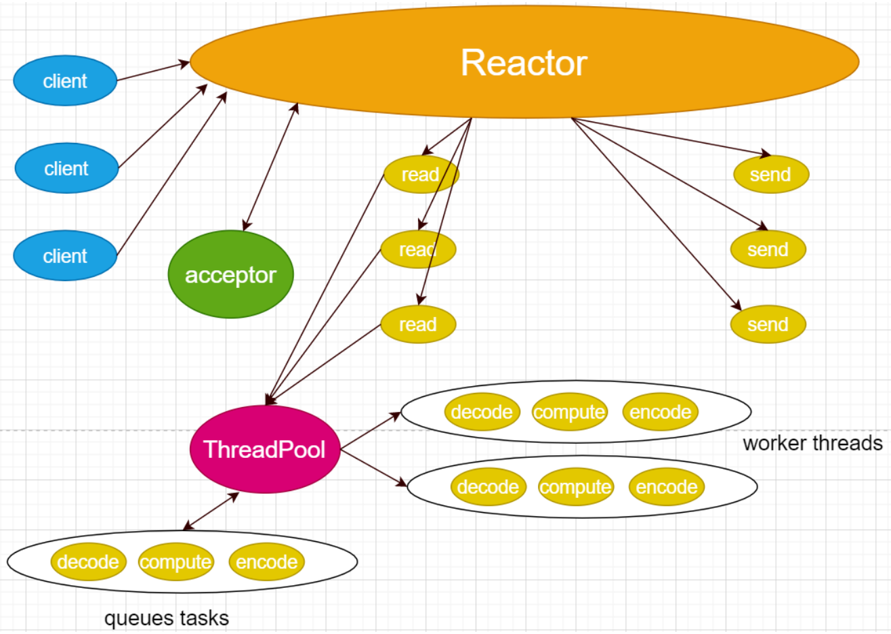
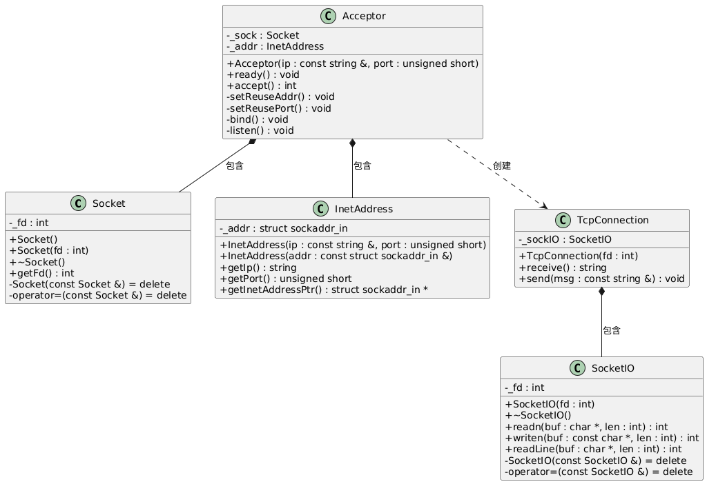
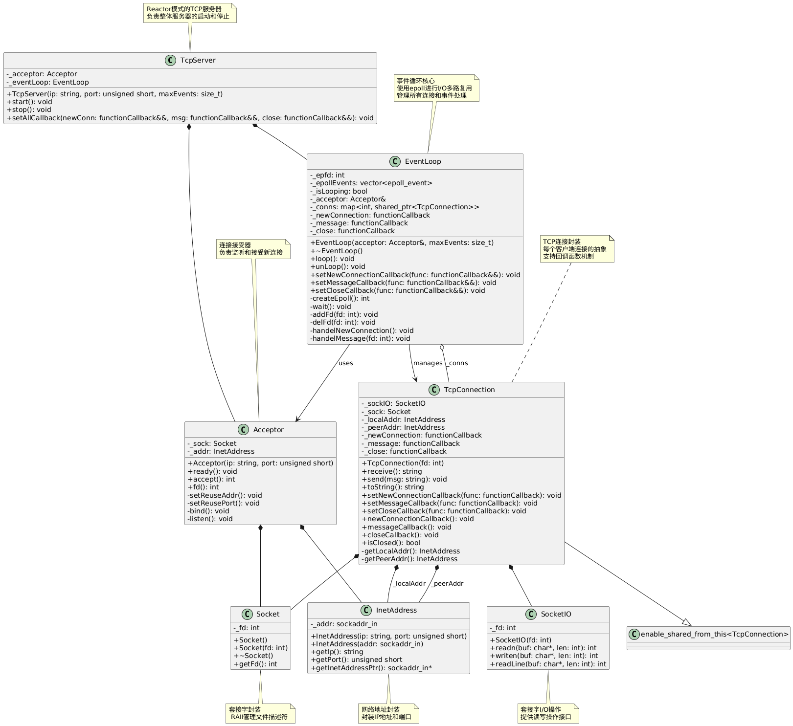
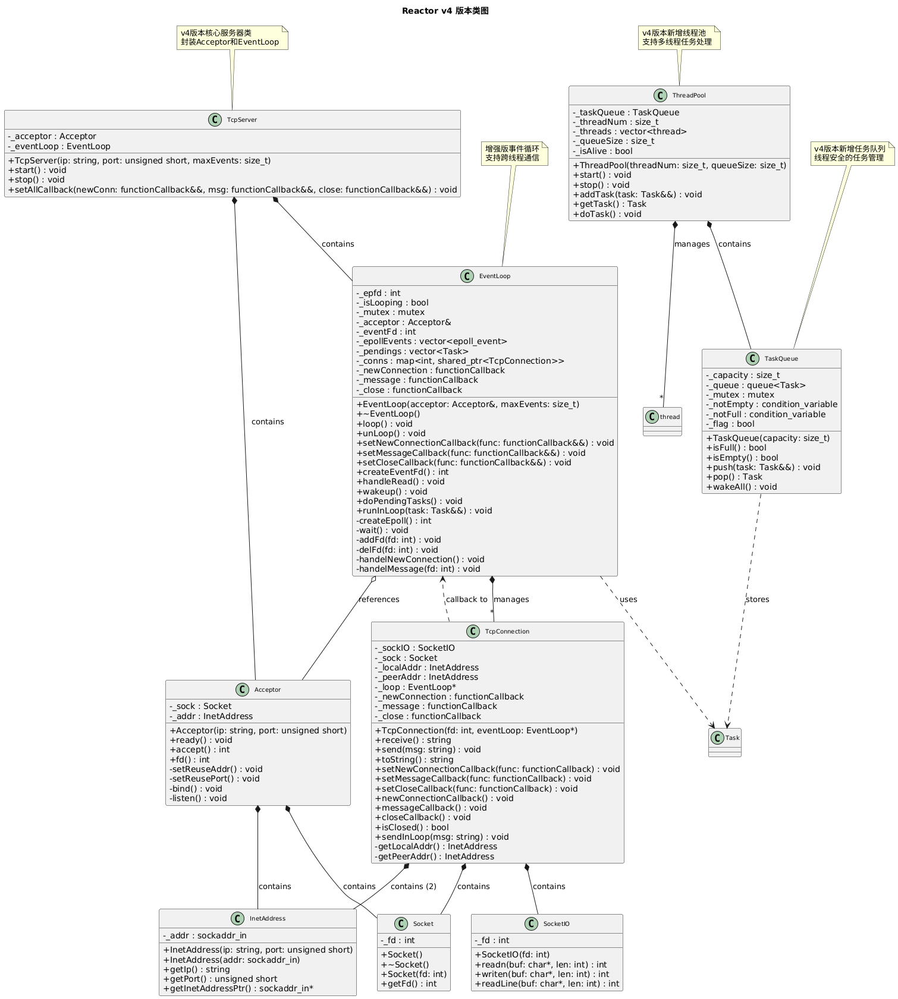
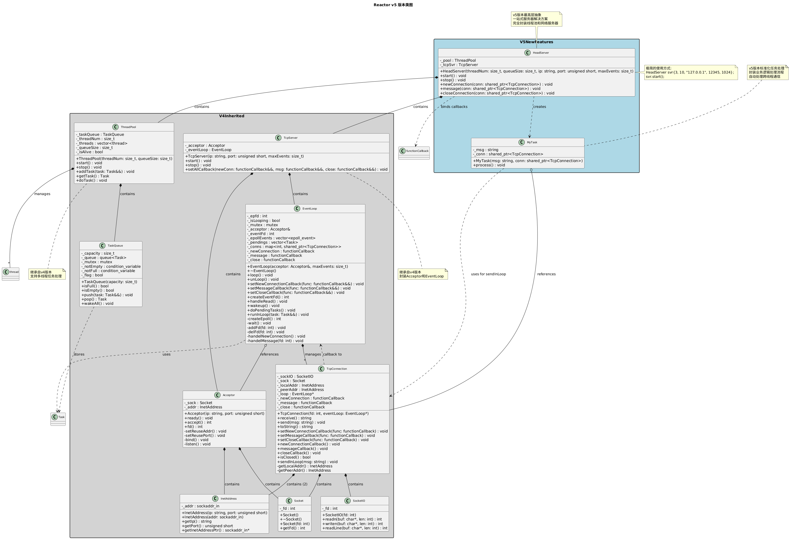

# 五种IO模型

## 阻塞式IO

当应用程序调用IO操作时，进程会被阻塞，直到数据准备好并且从内核空间复制到用户空间完成后才返回。

**特点：**

- 进程在等待IO操作完成期间完全被阻塞
- 效率较低，因为进程在等待期间无法处理其他任务
- 适用于连接数较少的场景

**工作流程：** 应用程序发起IO请求 → 内核准备数据 → 数据从内核复制到用户空间 → 返回结果

## 非阻塞式IO

应用程序调用IO操作时，如果数据没有准备好，内核立即返回错误，不会阻塞进程。应用程序需要不断轮询检查数据是否准备好。

**特点：**
- 进程不会被阻塞，可以继续执行其他任务
- 需要应用程序主动轮询，消耗CPU资源
- 在数据复制阶段仍然是阻塞的

**工作流程：** 应用程序轮询检查 → 数据未准备好时立即返回错误 → 数据准备好后进行复制 → 返回结果

## IO多路复用

<font color=red>**由一个线程监控多个网络请求**</font>（linux系统把所有网络请求以一个文件描述符来标识）,来完成数据状态询问的操作，当有数据准备就绪之后再分配对应的线程去读取数据。使用select、poll、epoll等系统调用，可以同时监控多个文件描述符，当其中任何一个准备好时就通知应用程序。

**特点：**
- 可以同时处理多个IO连接
- 避免了为每个连接创建线程的开销
- 适合高并发场景
- 在监控阶段是阻塞的，但可以同时监控多个连接

**工作流程：** 注册多个文件描述符到多路复用器 → 阻塞等待任一描述符就绪 → 处理就绪的描述符 → 数据复制到用户空间

## 信号驱动IO

**原理：** 应用程序向内核注册一个信号处理函数，当数据准备好时，内核发送信号通知应用程序，然后应用程序在信号处理函数中进行IO操作。

**特点：**
- 应用程序不需要阻塞等待
- 通过信号机制实现异步通知

**工作流程：** 注册信号处理函数 → 继续执行其他任务 → 内核数据准备好后发送信号 → 信号处理函数中进行数据复制

## 异步IO

**原理：** 应用程序发起IO请求后立即返回，内核负责完成整个IO操作（包括数据准备和复制），完成后通知应用程序。

**特点：**
- 真正的异步操作，应用程序完全不阻塞
- 性能最高，CPU利用率最好
- 需要操作系统底层支持（如Linux的AIO、Windows的IOCP）

**工作流程：** 发起异步IO请求 → 立即返回继续执行 → 内核完成数据准备和复制 → 通过回调或事件通知应用程序

## 总结对比

| IO模型     | 阻塞性         | 并发能力 | 适用场景                   |
| ---------- | -------------- | -------- | -------------------------- |
| 阻塞式IO   | 完全阻塞       | 低       | 简单单线程程序             |
| 非阻塞式IO | 轮询阶段不阻塞 | 中等     | 低并发、需轮询的场景       |
| IO多路复用 | 监控阶段阻塞   | 高       | 高并发、多连接场景（首选） |
| 信号驱动IO | 不阻塞         | 高       | 需异步通知的中等并发场景   |
| 异步IO     | 完全不阻塞     | 最高     | 高并发、实时性要求高的场景 |

# 并发服务器模型

## 循环式迭代式模型

循环式迭代式模型是一种简单的服务器处理模型，服务器按顺序处理客户端请求。

一种单线程的应用程序，只能使用短连接而不能使用长连接，缺点是无法充分利用多核CPU，不适合执行时间较长的服务，即适用于短连接（这样可以处理多个客户端），如果是长连接则需要在read/write之间循环，那么只能服务一个客户端。

所以循环式服务器只能使用短连接，而不能使用长连接，否则无法处理多个客户端的请求，因为整个程序是一个单线程的应用程序。

**特点：**

- 服务器一次只能处理一个客户端请求
- 处理完当前请求后才能处理下一个请求
- 适用于请求处理时间很短且并发量很小的场景


## 并发式服务器

并发式服务器能够同时处理多个客户端请求，通过多进程或多线程实现并发处理。

适合执行时间比较长的服务。在父进程中要关闭创建连接的套接字，等待下一个客户端请求连接，所以可以并发处理多个客户端的请求，一个客户端一个进程；子进程在处理客户端的请求，子进程是长连接的，不断处理请求，即使子进程中解包，计算，打包的过程时间过长，也不会影响父进程去连接其他客户端的请求。也适用于线程，主线程每次accept回来就创建一个子线程服务，由于线程共享文件描述符，故不用关闭，最后一个线程关闭监听套接字。

**特点：**

- 为每个客户端连接创建独立的进程或线程
- 能够同时处理多个请求
- 资源消耗较大（每个连接需要独立的进程/线程）
- 适用于中等并发量的应用


## prefork服务器

Prefork服务器预先创建一定数量的子进程，每个子进程处理客户端请求。

由于处理连接的进程/线程都是预先创建好的，因此可以减小创建进程/线程的开销，能够提高响应速度。进程预先fork了n个子进程（n的数目需要提前设定），每个子进程负责和客户端的通信，每个子进程执行的都是右图的流程。

前面的创建套接字，绑定端口号，监听套接字这些步骤，每个预先创建的进程已经完成，他们分别调用accept并由内核置入睡眠状态。

这种服务器的优点是：提高了响应速度，不需要引入父进程执行fork的开销，新客户就能得到处理。

缺点在于：每次启动服务器，父进程必须预测到底需要产生多少子进程，还有一个就是如果不考虑再派生子进程，先前派生的子进程可能被客户请求占用完，以后新到的请求只能先完成三次握手，并且达到listen接口的最大并发连接数backlog，直到有子进程可用。服务器才调用accept，将这些已经完成的连接传递给accept。

**特点：**

- 启动时预先fork出多个工作进程
- 避免了为每个请求动态创建进程的开销
- 进程数量相对固定，资源使用可控
- 适用于CPU密集型应用


## 反应式服务器

反应式服务器使用事件驱动的方式处理请求，通常基于IO多路复用技术。

服务器可以并发处理多个请求。不过本质上这些请求还是在一个线程中完成的，即：单线程轮询多个客户端。也无法充分利用多核CPU，不适合执行时间比较长的服务，所以为了让客户感觉是在“并发”处理而不是“循环”处理，每个请求必须在相对较短时间内执行。当然如果这个请求不能在有限的时间内完成，我们可以将这个请求拆分开来，使用有限状态机机制来完成。其中的Reactor可以使用IO多路复用`select/poll/epoll`来完成。

多路：监听多个文件描述符

复用：复用同一个进程（或者说同一个线程）

**特点：**

- 单线程事件循环处理所有请求
- 使用非阻塞IO和事件通知机制
- 内存占用小，能处理大量并发连接
- 适用于IO密集型应用
- 代表：Node.js、Nginx等


> 模型的过程解析：
>
> - Reactor是一个线程对象，该线程会启动事件循环，并使用select/poll/epoll来实现IO多路复用。注册一个Acceptor事件处理器到Reactor中，Acceptor事件处理器所关注的事件是accept事件，这样Reactor会监听客户端向服务器端发起的连接请求事件。
>
> - 客户端向服务器端发起一个连接请求，Reactor监听到了该accept事件的发生并将该accept事件派发给相应的Acceptor处理器来进行处理。Acceptor处理器通过accept方法得到与这个客户端对应的连接，然后将该连接所关注的读事件以及对应的read读事件处理器注册到Reactor中，这样Reactor就会监听该连接的read事件了。或者当需要向客户端发送数据时，就向Reactor注册该连接的写事件和其处理器。
>
> - 当Reactor监听到有读或者写事件发生时，将调用dispatch将相关的事件分发给对应的处理器进行处理。比如，读处理器会通过read方法读取数据，此时read操作可以直接读取到数据，而不会堵塞与等待可读的数据到来。
>
> - 每当处理完所有就绪的I/O事件后，Reactor线程会再次执行IO多路复用的函数阻塞等待新的事件就绪并将其分派给对应处理器进行处理。

> 目前的单线程Reactor模式中，不仅I/O操作在该Reactor线程上，连非I/O的业务操作也在该线程上进行处理了，这可能会大大延迟I/O请求的响应。**所以应该将非I/O的业务逻辑操作从Reactor线程上分离出去，以此来加速Reactor线程对I/O请求的响应**。这种的服务器的并发量比并发式服务器多，因为并发式服务器能够创建的进程或者线程数目是有限的。

## 反应式 + 线程池型服务器

反应式 + 线程池型服务器结合了反应式模型和线程池的优势。

与单线程Reactor模式不同的是，增加了线程池对象，并将业务逻辑的处理从Reactor线程中移出转交给工作的线程池来执行。这样能够提高Reactor线程的I/O响应，不至于因为一些耗时的业务逻辑而延迟对后面I/O请求的处理。

**特点：**

- 主线程使用反应式模型处理IO事件
- 将CPU密集型任务分发给线程池处理
- 既能处理大量并发连接，又能处理CPU密集型任务
- 避免了CPU密集型任务阻塞事件循环
- 现代高性能服务器的常用模型



使用线程池带来的好处有如下几点：

- 线程池中的线程是提前创建好的，这样可以在处理多个请求时分摊在线程创建和销毁过程产生的巨大开销。
- 将IO操作与非IO操作分离，当请求到达时工作线程通常已经存在，因此不会由于等待创建线程而延迟任务的执行，从而提高了响应性。
- 可以进行职责分离，<font color=red>**让IO线程做IO操作，线程池处理业务逻辑**</font>，处理大量计算，充分利用CPU的计算优势。

在这个模型之下，线程池中的线程处理完业务逻辑，需要与Reactor线程进行通信，把结果交给Reactor，再由它发送给客户端。

(必然要通过线程间通信，让Reactor线程与线程池中的工作线程交换数据)

## 多反应式服务器

多反应式服务器运行多个反应式事件循环，通常每个CPU核心对应一个事件循环。上面的模型中，Reactor代表的是一个进程（一个线程），既负责监听，又负责IO，<font color=red>**如果在执行监听或者执行IO时是采用的阻塞式，也会导致其他的业务等待**</font>。

进一步改进：

一个主线程，多个工作线程，主线程Reactor负责接收客户端连接，每个线程有各自的Reactor负责执行任务队列中的任务。

**特点：**

- 多个独立的事件循环并行运行
- 充分利用多核CPU资源
- 每个事件循环处理部分连接
- 避免了单个事件循环的性能瓶颈
- 需要合理的负载均衡策略


## 多反应式+ 线程池模型

多反应式 + 线程池模型是最复杂但也是性能最优的服务器架构。

多个Reactor的模式，mainReactor与subReactor都是一个线程，因为多进程之间无法共享计算线程池。这种模型能够适用IO频繁且计算密集的服务。

**特点：**

- 多个反应式事件循环处理IO事件
- 共享的线程池处理CPU密集型任务
- 最大化利用系统资源
- 能够处理超大规模并发
- 实现复杂度最高
- 现代高性能服务器框架的首选架构


# Reactor模型

## [测试客户端代码](https://github.com/CHARNARIE/Learning-outline/tree/main/Code/Reactor/client.cc)

## ReactorV1

### 类图



### [完整代码](https://github.com/CHARNARIE/Learning-outline/tree/main/Code/Reactor/Reactor_v1)

### 说明

这个版本实现了基本的TCP服务器功能。服务器接收客户端连接，读取客户端发送的消息，将消息中的字母转换为大写后返回给客户端。

**项目结构**

```
Reactor_v1/
├── main.cpp            # 主程序入口
├── Acceptor.h/cpp      # 连接接受器类
├── TcpConnection.h/cpp # TCP连接处理类
├── Socket.h/cpp        # Socket封装类
├── SocketIO.h/cpp      # Socket IO操作类
├── InetAddress.h/cpp   # 网络地址封装类
└── Makefile            # 编译配置文件
```

#### 组件说明

**1. Socket类**

- **功能**: 封装了基本的socket文件描述符操作
- **特点**: 
  - 构造函数自动创建TCP socket
  - 析构函数自动关闭socket
  - 禁用拷贝构造和赋值操作，确保资源安全

**2. InetAddress类**

- **功能**: 封装网络地址信息(IP和端口)
- **特点**:
  - 支持通过IP字符串和端口号构造
  - 支持通过sockaddr_in结构体构造
  - 提供获取IP、端口和地址指针的接口

**3. SocketIO类**

- **功能**: 提供可靠的socket读写操作
- **核心方法**:
  - `readn()`: 读取指定字节数的数据
  - `writen()`: 写入指定字节数的数据
  - `readLine()`: 按行读取数据

**4. Acceptor类**

- **功能**: 负责服务器socket的初始化和客户端连接接受
- **核心方法**:
  - `ready()`: 完成socket的绑定和监听准备
  - `accept()`: 接受客户端连接

**5. TcpConnection类**

- **功能**: 基于SocketIO实现可靠的数据传输,处理与客户端的数据通信
- **核心方法**:
  - `receive()`: 接收客户端消息
  - `send()`: 向客户端发送消息

#### 程序流程

1. **服务器启动**: 创建Acceptor对象，绑定到127.0.0.1:12345
2. **准备监听**: 调用ready()方法完成socket配置和监听
3. **接受连接**: 等待并接受客户端连接，创建TcpConnection对象
4. **消息处理**: 循环接收客户端消息，将字母转为大写后返回
5. **持续服务**: 在无限循环中持续为当前连接提供服务

#### 局限性
1. **单连接处理**: 一次只能处理一个客户端连接
2. **阻塞IO**: 使用传统的阻塞IO模型
4. **无并发**: 不支持多客户端同时连接

## ReactorV2

### 类图


### [完整代码](https://github.com/CHARNARIE/Learning-outline/tree/main/Code/Reactor/Reactor_v2)

### 说明

Reactor_v2 是基于 Reactor 模式的网络服务器实现的第二个版本，相比 v1 版本，引入了事件循环机制，使用 epoll 实现了高效的 I/O 多路复用，能够同时处理多个客户端连接。

#### 核心特性

**1. 事件驱动架构**

- 使用 epoll 实现 I/O 多路复用
- 基于事件循环的非阻塞处理模式
- 支持同时处理多个客户端连接

**2. 回调机制**

- 新连接建立回调
- 消息接收回调
- 连接关闭回调

**3. 连接管理**

- 自动管理客户端连接的生命周期
- 连接状态检测和清理
- 连接信息的完整记录

#### 组件

**EventLoop（事件循环）**

- **功能**：核心事件循环管理器
- **职责**：
  - 管理 epoll 实例
  - 监听文件描述符事件
  - 分发事件到相应的处理函数
  - 管理所有活跃连接

**Acceptor（连接接受器）**

- **功能**：负责接受新的客户端连接
- **职责**：
  - 创建监听套接字
  - 绑定地址和端口
  - 接受新连接请求

**TcpConnection（TCP连接）**

- **功能**：封装单个客户端连接
- **职责**：
  - 处理数据收发
  - 管理连接状态
  - 执行回调函数
  - 连接信息管理

**Socket、SocketIO、InetAddress**

- **功能**：底层网络操作封装
- **职责**：
  - 套接字操作封装
  - 网络 I/O 操作
  - 地址信息管理

#### 工作流程

1. **初始化阶段**
   ```cpp
   Acceptor acceptor{"127.0.0.1", 12345};
   acceptor.ready();
   EventLoop eventLoop{acceptor, 1024};
   ```

2. **设置回调函数**
   ```cpp
   eventLoop.setNewConnectionCallback(functionCallback(newConnection));
   eventLoop.setMessageCallback(functionCallback(message));
   eventLoop.setCloseCallback(functionCallback(closeConnection));
   ```

3. **启动事件循环**
   ```cpp
   eventLoop.loop();
   ```

4. **事件处理**
   - 监听套接字有事件 → 处理新连接
   - 客户端套接字有事件 → 处理消息或连接关闭

### 相比 v1 版本的改进

1. **并发处理能力**：从单连接处理升级为多连接并发处理
2. **I/O 效率**：使用 epoll 替代阻塞 I/O，提高处理效率
3. **事件驱动**：引入事件循环机制，实现真正的事件驱动架构
4. **连接管理**：完善的连接生命周期管理
5. **可扩展性**：更好的架构设计，为后续版本奠定基础

## ReactorV3

### 类图



### [完整代码](https://github.com/CHARNARIE/Learning-outline/tree/main/Code/Reactor/Reactor_v3)

### 说明

Reactor_v3 是基于 Reactor 模式的网络服务器实现的第三个版本，相比 v2 版本，引入了 **TcpServer** 高层抽象类，提供了更加简洁和易用的 API 接口，进一步封装了服务器的启动、停止和回调设置等操作。

#### 核心特性

**1. 高层抽象封装**

- 引入 TcpServer 类，提供统一的服务器接口
- 简化了服务器的使用方式
- 隐藏了底层 EventLoop 和 Acceptor 的复杂性

**2. 简洁的 API 设计**

- 一键式服务器启动和停止
- 统一的回调函数设置接口
- 更加直观的使用方式

**3. 保持原有优势**

- 继承 v2 版本的事件驱动架构
- 保持 epoll 高效 I/O 多路复用
- 维持良好的并发处理能力

#### 新增组件

**TcpServer（TCP服务器）**

- **功能**：高层服务器抽象类
- **职责**：
  - 统一管理 Acceptor 和 EventLoop
  - 提供简洁的服务器控制接口
  - 封装回调函数的设置
  - 简化服务器的生命周期管理

#### 工作流程

1. **创建服务器实例**
   ```cpp
   TcpServer server{"127.0.0.1", 12345, 1024};
   ```

2. **设置回调函数**
   ```cpp
   server.setAllCallback(newConnection, message, closeConnection);
   ```

3. **启动服务器**
   ```cpp
   server.start();
   ```

4. **停止服务器**
   ```cpp
   server.stop();
   ```

**内部工作流程**

1. **初始化阶段**
   - TcpServer 创建 Acceptor 和 EventLoop 实例
   - Acceptor 准备监听套接字
   - EventLoop 初始化 epoll 实例

2. **启动阶段**
   - 调用 Acceptor::ready() 开始监听
   - 启动 EventLoop::loop() 进入事件循环

3. **运行阶段**
   - 监听新连接和消息事件
   - 自动分发到相应的回调函数
   - 管理连接的生命周期

4. **停止阶段**
   - 调用 EventLoop::unLoop() 退出事件循环
   - 自动清理资源

### 相比 v2 版本的改进

**1. 更高层次的抽象**

- **v2 版本**：需要直接操作 Acceptor 和 EventLoop
- **v3 版本**：通过 TcpServer 统一管理，隐藏实现细节

**2. 更简洁的 API**

- **v2 版本**：
  ```cpp
  Acceptor acceptor{"127.0.0.1", 12345};
  acceptor.ready();
  EventLoop eventLoop{acceptor, 1024};
  eventLoop.setNewConnectionCallback(functionCallback(newConnection));
  eventLoop.setMessageCallback(functionCallback(message));
  eventLoop.setCloseCallback(functionCallback(closeConnection));
  eventLoop.loop();
  ```

- **v3 版本**：
  ```cpp
  TcpServer server{"127.0.0.1", 12345, 1024};
  server.setAllCallback(newConnection, message, closeConnection);
  server.start();
  ```

**3. 更好的封装性**

- 用户无需了解 EventLoop 和 Acceptor 的具体实现
- 提供了清晰的服务器生命周期管理
- 减少了用户代码的复杂性

**4. 更易维护**

- 集中管理服务器组件
- 统一的错误处理
- 更清晰的职责分离

## ReactorV4

### 类图



### [完整代码](https://github.com/CHARNARIE/Learning-outline/tree/main/Code/Reactor/Reactor_v4)

### 说明

Reactor_v4 是基于 Reactor 模式的网络服务器实现的第四个版本，相比 v3 版本，引入了 **线程池（ThreadPool）** 和 **任务队列（TaskQueue）**，实现了 **Reactor + ThreadPool** 的混合架构。这种设计将 I/O 处理和业务逻辑处理分离，显著提升了服务器的并发处理能力和性能。

#### 核心特性

**1. Reactor + ThreadPool 混合架构**

- 主线程负责 I/O 事件处理（Reactor 模式）
- 工作线程池负责业务逻辑处理
- 实现了 I/O 密集型和 CPU 密集型任务的分离

**2. 线程池管理**

- 可配置的线程数量
- 基于任务队列的工作分配
- 优雅的线程池启动和停止机制

**3. 任务队列**

- 线程安全的任务队列实现
- 支持阻塞式任务获取
- 可配置的队列容量

**4. 跨线程通信**

- 使用 eventfd 实现线程间通信
- 线程池处理完任务后可安全地将结果发送回主线程
- 保证了网络 I/O 操作的线程安全性

#### 新增组件

**ThreadPool（线程池）**

- **功能**：管理工作线程，处理业务逻辑
- **职责**：
  - 创建和管理指定数量的工作线程
  - 从任务队列获取任务并执行
  - 提供线程池的启动和停止控制
  - 支持任务的异步执行

**TaskQueue（任务队列）**

- **功能**：线程安全的任务存储和分发
- **职责**：
  - 存储待执行的任务
  - 提供线程安全的任务添加和获取操作
  - 支持阻塞式等待和通知机制
  - 容量控制和流量管理

**EventLoop（事件循环）- 增强版**

- **功能**：核心事件循环管理器（在 v3 基础上增强）
- **新增职责**：
  - 管理 eventfd 用于跨线程通信
  - 处理来自线程池的任务结果
  - 提供 runInLoop 方法支持跨线程操作
  - 维护待执行任务队列

**TcpConnection（TCP连接）- 增强版**

- **功能**：封装单个客户端连接（在 v3 基础上增强）
- **新增职责**：
  - 提供 sendInLoop 方法支持跨线程发送
  - 持有 EventLoop 引用以支持跨线程操作
  - 确保网络操作的线程安全性

#### 工作流程

**1. 初始化阶段**

```cpp
// 创建线程池
ThreadPool pool{3, 10};  // 3个工作线程，队列容量10
pool.start();

// 创建服务器
TcpServer svr{"127.0.0.1", 12345, 1024};
svr.setAllCallback(newConnection, message, closeConnection);
```

**2. 运行阶段**

```cpp
// 启动服务器（主线程进入事件循环）
svr.start();
```

**3. 请求处理流程**

1. **主线程（Reactor）**：
   - 监听网络事件（新连接、数据到达）
   - 接受新连接
   - 读取客户端数据

2. **工作线程（ThreadPool）**：
   - 从任务队列获取业务处理任务
   - 执行具体的业务逻辑
   - 处理完成后通过 sendInLoop 发送结果

3. **跨线程通信**：
   - 工作线程通过 eventfd 唤醒主线程
   - 主线程执行待处理任务（如发送响应）
   - 确保所有网络 I/O 在主线程中执行

#### 技术实现

**线程池实现**

```cpp
class ThreadPool {
public:
    ThreadPool(size_t threadNum, size_t queueSize);
    void start();           // 启动所有工作线程
    void stop();            // 停止线程池
    void addTask(Task &&task);  // 添加任务到队列
    
private:
    void doTask();          // 工作线程执行函数
    TaskQueue _taskQueue;   // 任务队列
    vector<thread> _threads; // 工作线程集合
};
```

**任务队列实现**

```cpp
class TaskQueue {
public:
    void push(Task &&task);     // 线程安全的任务添加
    Task pop();                 // 阻塞式任务获取
    void wakeAll();             // 唤醒所有等待线程
    
private:
    queue<Task> _queue;         // 任务队列
    mutex _mutex;               // 互斥锁
    condition_variable _notEmpty; // 条件变量
    condition_variable _notFull;
};
```

**跨线程通信**

```cpp
// EventLoop 中的跨线程任务执行
void EventLoop::runInLoop(Task &&task) {
    std::unique_lock<mutex> ul{_mutex};
    _pendings.push_back(std::move(task));
    ul.unlock();
    wakeup();  // 通过 eventfd 唤醒主线程
}

// TcpConnection 中的跨线程发送
void TcpConnection::sendInLoop(const string &msg) {
    if (_loop) {
        _loop->runInLoop(std::bind(&TcpConnection::send, this, msg));
    }
}
```

**eventfd 通信机制**

```cpp
// 创建用于线程间通信的文件描述符
int EventLoop::createEventFd() {
    return eventfd(0, 0);
}

// 唤醒主线程
void EventLoop::wakeup() {
    uint64_t one = 1;
    write(_eventFd, &one, sizeof(uint64_t));
}

// 处理唤醒事件
void EventLoop::handleRead() {
    uint64_t one = 1;
    read(_eventFd, &one, sizeof(uint64_t));
}
```

### 相比 v3 版本的改进

**1. 并发处理能力大幅提升**

- **v3 版本**：单线程处理所有逻辑，CPU 密集型任务会阻塞 I/O
- **v4 版本**：多线程并行处理业务逻辑，I/O 和计算分离

**2. 更好的资源利用**

- **v3 版本**：只能利用单核 CPU
- **v4 版本**：可以充分利用多核 CPU 资源

**3. 更高的吞吐量**

- **v3 版本**：受限于单线程处理能力
- **v4 版本**：通过线程池实现更高的并发处理能力

**4. 更好的响应性**

- **v3 版本**：长时间的业务处理会影响其他连接
- **v4 版本**：I/O 处理和业务处理分离，响应更及时

## ReactorV5

### 类图



### [完整代码](https://github.com/CHARNARIE/Learning-outline/tree/main/Code/Reactor/Reactor_v5)

### 说明

Reactor_v5 是基于 Reactor 模式的网络服务器实现的第五个版本，也是最终完善版本。相比 v4 版本，引入了 **HeadServer** 统一管理类，实现了线程池和网络服务器的完全整合，提供了一站式的高性能网络服务器解决方案。

#### 核心特性

**1. 一站式服务器解决方案**

- 引入 HeadServer 作为最高层抽象
- 完全封装线程池和网络服务器的复杂性
- 提供极简的 API 接口
- 开箱即用的高性能服务器

**2. 完全整合的架构**

- 线程池与网络服务器无缝集成
- 自动化的生命周期管理
- 统一的配置和控制接口
- 内置的任务处理机制

**3. 极简的使用方式**

- 只需几行代码即可启动高性能服务器
- 自动处理所有底层复杂性
- 内置合理的默认配置
- 专注于业务逻辑开发

#### 新增组件

**HeadServer（主服务器）**

- **功能**：最高层服务器管理类
- **职责**：
  - 统一管理 ThreadPool 和 TcpServer
  - 提供简洁的服务器控制接口
  - 自动配置和初始化所有组件
  - 处理服务器的完整生命周期
  - 内置标准的回调函数实现

**MyTask（任务处理类）**

- **功能**：标准化的任务处理封装
- **职责**：
  - 封装业务逻辑处理流程
  - 提供统一的任务执行接口
  - 自动处理跨线程通信
  - 简化任务开发复杂度

#### 工作流程

```cpp
#include "HeadServer.h"

int main() {
    // 创建服务器：3个工作线程，队列容量10，监听127.0.0.1:12345，最大事件数1024
    HeadServer svr{3, 10, "127.0.0.1", 12345, 1024};
    
    // 启动服务器
    svr.start();
    
    // 停止服务器
    svr.stop();
    
    return 0;
}
```

**内部工作流程**

1. **初始化阶段**
   ```cpp
   HeadServer::HeadServer(size_t threadNum, size_t queueSize, 
                         const string &ip, unsigned short port, size_t maxEvents)
       : _pool(threadNum, queueSize), _tcpSvr(ip, port, maxEvents) {}
   ```

2. **启动阶段**
   ```cpp
   void HeadServer::start() {
       _pool.start();  // 启动线程池
       // 设置回调函数
       _tcpSvr.setAllCallback(
           std::bind(&HeadServer::newConnection, this, _1),
           std::bind(&HeadServer::message, this, _1),
           std::bind(&HeadServer::closeConnection, this, _1)
       );
       _tcpSvr.start();  // 启动网络服务器
   }
   ```

3. **运行阶段**
   
   - HeadServer 自动处理所有网络事件
   - 内置的回调函数处理连接管理
   - 自动分发任务到线程池
   - 透明的跨线程通信
   
4. **停止阶段**
   ```cpp
   void HeadServer::stop() {
       _pool.stop();    // 停止线程池
       _tcpSvr.stop();  // 停止网络服务器
   }
   ```

#### 技术实现

**HeadServer 统一管理**

```cpp
class HeadServer {
public:
    HeadServer(size_t threadNum, size_t queueSize, 
               const string &ip, unsigned short port, size_t maxEvents);
    
    void start();  // 一键启动
    void stop();   // 一键停止
    
    // 内置回调函数
    void newConnection(const shared_ptr<TcpConnection> &conn);
    void message(const shared_ptr<TcpConnection> &conn);
    void closeConnection(const shared_ptr<TcpConnection> &conn);
    
private:
    ThreadPool _pool;   // 线程池组件
    TcpServer _tcpSvr;  // 网络服务器组件
};
```

**标准化任务处理**

```cpp
class MyTask {
public:
    MyTask(const string &msg, const shared_ptr<TcpConnection> &conn);
    void process();  // 标准化的处理接口
    
private:
    string _msg;
    shared_ptr<TcpConnection> _conn;
};

void MyTask::process() {
    // 业务逻辑处理
    // 处理(_msg);
    
    // 自动发送结果
    _conn->sendInLoop(_msg);
}
```

**自动回调绑定**

```cpp
void HeadServer::start() {
    _pool.start();
    using namespace std::placeholders;
    _tcpSvr.setAllCallback(
        std::bind(&HeadServer::newConnection, this, _1),
        std::bind(&HeadServer::message, this, _1),
        std::bind(&HeadServer::closeConnection, this, _1)
    );
    _tcpSvr.start();
}
```

### 相比 v4 版本的改进

**1. 极大简化的使用方式**

- **v4 版本**：需要手动管理线程池和服务器
  ```cpp
  ThreadPool pool{3, 10};
  pool.start();
  gPool = &pool;
  
  TcpServer svr{"127.0.0.1", 12345, 1024};
  svr.setAllCallback(newConnection, message, closeConnection);
  svr.start();
  ```

- **v5 版本**：一行代码创建，一行代码启动
  ```cpp
  HeadServer svr{3, 10, "127.0.0.1", 12345, 1024};
  svr.start();
  ```

**2. 更好的封装性**

- **v4 版本**：需要了解线程池和服务器的内部细节
- **v5 版本**：完全隐藏内部实现，专注业务逻辑

**3. 更强的内聚性**

- **v4 版本**：组件间耦合度较高，需要手动协调
- **v5 版本**：所有组件完全整合，自动协调工作

**4. 更好的可维护性**

- **v4 版本**：需要维护多个独立组件
- **v5 版本**：统一的管理接口，降低维护复杂度

### 总结

#### 架构演进

**v1 → v2：引入事件循环**

- 从单连接处理到多连接并发
- 引入 epoll 和事件驱动机制

**v2 → v3：增加高层抽象**

- 引入 TcpServer 简化使用
- 提供统一的服务器接口

**v3 → v4：引入线程池**

- 实现 Reactor + ThreadPool 架构
- 分离 I/O 处理和业务逻辑

**v4 → v5：完全整合**

- 引入 HeadServer 统一管理
- 实现一站式服务器解决方案

#### 设计原则

**1. 单一职责原则**

- HeadServer：服务器管理
- MyTask：任务处理
- ThreadPool：线程管理
- TcpServer：网络服务

**2. 开闭原则**

- 对扩展开放：可以自定义 MyTask 实现
- 对修改封闭：核心架构稳定不变

**3. 依赖倒置原则**

- 高层模块不依赖低层模块
- 通过抽象接口进行交互

**4. 接口隔离原则**

- 提供最小化的必要接口
- 隐藏不必要的实现细节

#### 性能特点

**1. 高并发能力**

- 支持大量并发连接
- 多线程并行处理
- 高效的事件驱动机制

**2. 低资源消耗**

- 预分配线程池，避免频繁创建销毁
- 高效的内存管理
- 最小化的系统调用

**3. 高吞吐量**

- 充分利用多核 CPU
- 流水线式处理
- 优化的 I/O 操作

**4. 低延迟**

- 事件驱动的快速响应
- 最小化的处理路径
- 高效的跨线程通信
